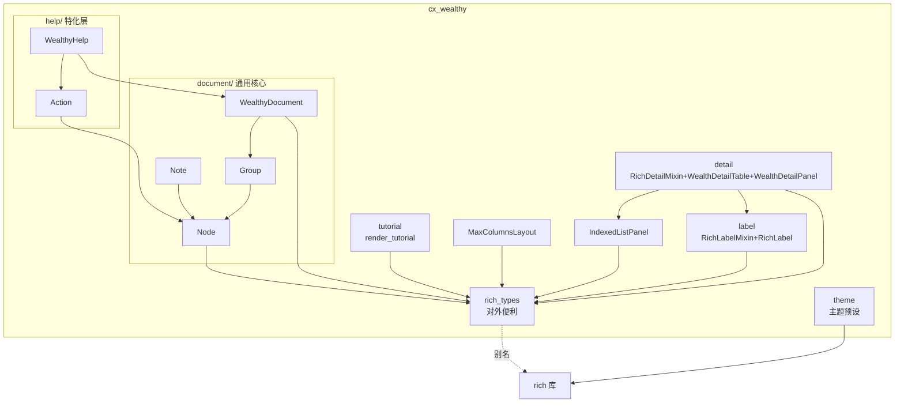

# cx-wealthy 设计文档

> **文档用途**：本文档是 `cx-wealthy` 包的完整设计规格，供实现者在新会话中独立开展工作。涵盖背景、设计意图、决策依据、模块清单、API 规格、旧版问题对照与迁移指南。
>
> **阅读顺序**：先通读「一、背景」至「四、架构总览」建立全局认知，再按「五、功能规格」逐模块实现，最后用「六、问题对照」与「七、迁移指南」做验收检查。

---

## 一、背景与动机

### 1.1 cx-wealth 的历史与问题

`cx-wealth` 是 monorepo `cx-studio-tk` 中基于 [Rich](https://github.com/Textualize/rich) 的终端 UI 组件库，处在依赖链 `cx-studio ← cx-wealth ← cxalio-studio-tools` 中间。它提供两大能力：

1. **双渲染协议**——`__rich_label__`（紧凑标签）与 `__rich_detail__`（键值面板），让领域对象有统一的"列表行 / 详情卡"呈现入口。
2. **声明式帮助系统 DSL**——通过 `add_group` / `add_action` / `add_note` 构建结构化帮助，替代 argparse 原生输出。

设计方向正确，但经过对包内实现与 5 个使用方（hosts_keeper / ffpretty / media_scout / media_killer / jpegger）的全面审查，识别出 **45 项问题**，涵盖功能性 Bug、协议语义混淆、抽象覆盖缺口、封装泄漏、死代码等多个层面。其中最关键的包括：

- **DEFAULT_STYLES 类属性被实例共享污染**：`self.styles = self.DEFAULT_STYLES` 引用而非拷贝，一个实例传 styles 会污染所有后续实例。
- **IndexedListPanel 截断分支索引错乱**：用 `start_index` 当列表下标，跳过首项；末行索引计算错误。
- **render_usage 的 groupby 依赖未排序输入**：非连续相同 key 的 actions 会被错误分组、丢失。
- **make_table 对 str/bytes 误处理**：被当作 Iterable 物化成字符列表。
- **i18n 模块形同虚设**：`_()` 全包零调用，硬编码中文标题。
- **协议语义重叠**：`__rich_detail__` 与 Rich 原生 `__rich_repr__` 在 detail 场景语义高度重叠，使用方混淆误用（Profile 实现错协议、SimpleAppContext 双协议但只有一个生效）。
- **抽象覆盖缺口**：5 个工具的 `show_full_help` 几乎完全重复；使用方 Mission 绕开 WealthLabel 自己实现 `__rich__`；缺多列展示组件。
- **渲染范式错误**：`__rich_console__` 直接调用 `console.render()` 返回而非 yield，该反模式被使用方复制。
- **pyproject.toml 注册不存在的 `cx-wealth:main` 入口**。

完整问题清单见「六、问题对照」。

### 1.2 为什么新建 cx-wealthy 而非改造 cx-wealth

| 维度 | 改造 cx-wealth | 新建 cx-wealthy |
|---|---|---|
| API 兼容性 | 必须保持，限制重构空间 | 可彻底重设计 |
| 使用方迁移 | 一次性破坏性切换 | 新旧并存、逐步迁移 |
| 历史包袱 | _Node 树、双协议、rich_types 内外不分等须逐一修 | 从头规避 |
| 发布风险 | 破坏现有 PyPI 用户 | 新包独立发布，零风险 |

**决策**：新建 `cx-wealthy`，`cx-wealth` 最终废弃。新旧并存期间使用方逐步迁移，迁移完成后 `cx-wealth` 停止维护。

### 1.3 与 cx-wealth 的关系

- `cx-wealthy` 是 `cx-wealth` 的**继任者**，非并存替代品。
- 迁移期内两者共存于 monorepo；`cxalio-studio-tools` 逐步从 `cx-wealth` 切换到 `cx-wealthy`。
- `cx-wealth` 最终从 workspace 移除并停止维护。
- `cx-wealthy` **不提供** cx-wealth 兼容层或迁移桥接（如 `from_argparse` adapter）——从头设计意味着干净切断。

---

## 二、定位与设计原则

### 2.1 定位

`cx-wealthy` 是 Rich 的扩展层，提供两大核心能力：

1. **通用结构化文档系统**——基于复合树的声明式文档构建与主题化渲染。帮助系统只是其特化之一，任何需要"分组 + 条目 + 注释"结构化输出的场景都可使用。
2. **双渲染协议**——`__rich_label__`（紧凑标签）+ `__rich_detail__`（键值面板），通过 mixin 让"协议即渲染"成立，同时提供包装器给不愿继承的使用方。

### 2.2 核心设计原则

1. **通用核心与特化分层**：`document/` 是通用复合树，`help/` 是帮助特化。通用核心不知道 flags/nargs/usage 为何物。
2. **mixin + 包装器双轨**：愿继承的使用方用 mixin（协议即渲染）；不愿继承的用包装器。两者共享底层渲染逻辑。
3. **抽象克制**：一个抽象至少有 2 个真实使用场景才入库。宁可让使用方先用 Rich 原生 API 凑合，等需求清晰后再提取。
4. **rich_types 仅对外**：库内部用真实 `from rich.xxx import Yyy` 路径，`rich_types` 收窄为对外便利出口。
5. **标准渲染范式**：`__rich_console__` 必须 yield 渲染对象，禁止直接调用 `console.render()` 返回。
6. **每个模块有 `__all__`**：`__init__.py` 显式导出，不泄漏 typing 等第三方符号。
7. **不依赖 cx-studio**：尽量零依赖，仅在 cx-系列主题预设等纯数据场景自给自足。

### 2.3 依赖与 i18n 策略

- **依赖**：仅 `rich>=14.0.0`，不依赖 `cx-studio`。
- **i18n**：**不实现**。理由：`cx-wealthy` 作为 UI 组件库，其自身输出的文字（如面板标题"用法"、"参数详情"、"(empty)" 等占位符）属于框架固定文本，按项目惯例应由使用方控制而非库自行翻译。若未来确有 i18n 需求，再按项目既有方案（包级共享 `_` via `make_gettext`）落地。
- **依赖链位置**：仍处于 `cx-studio ← cx-wealthy ← cxalio-studio-tools`，但 `cx-wealthy` 不反向依赖 `cx-studio`。`cxalio-studio-tools` 同时依赖两者，迁移完成后仅依赖 `cx-wealthy`。
- **主题预设**：`cx-wealthy` 提供 `cx.*` 命名空间的主题样式（`cx.success` / `cx.error` / `cx.warning` / `cx.info` / `cx.whisper` / `cx.number` 等），供 `cxalio-studio-tools` 使用。这是纯数据，不引入依赖。

---

## 三、核心设计决策

以下 9 项决策均经过讨论确认，每项附依据。

### 决策 1：保留 `__rich_detail__` 协议，不复用 `__rich_repr__`

**决策**：保留 `cx-wealth` 原创的 `__rich_detail__` 协议，不复用 Rich 原生的 `__rich_repr__`。

**依据**：两者语义不等价。

| 维度 | `__rich_repr__`（Rich 原生） | `__rich_detail__`（cx-wealthy） |
|---|---|---|
| 语义 | debug repr——"这个对象长什么样" | 展示——"这个对象该展示哪些字段" |
| value 渲染 | `Pretty`（repr 风格） | 递归 sub-box / IndexedListPanel / RichLabel 协同 |
| 嵌套约定 | 无 | value 若实现同协议则自动嵌套渲染为 sub-panel |
| value 格式化 | raw 值交给 Pretty | 使用方可预格式化（如 `str(path)`） |
| 去重 | `(key, value, default)` 三元组 | **新版吸收此能力**，支持三元组 |

使用方行为证明两者语义不同：`SimpleAppContext` 同时实现两者（`__rich_repr__` 给全量 debug，`__rich_detail__` 给精简展示）；`Mission.__rich_detail__` 里手动 `str(self.source)` 转换（展示视角想要格式化字符串，非 raw Path）。

**改进**：新版 `__rich_detail__` 吸收 `__rich_repr__` 的去重能力，支持 `(key, value, default)` 三元组——当 `value == default` 时该行不显示。让使用方不必手写 `if self.x: yield ...`。

**否决的替代方案：复用 `__rich_repr__`，不保留 `__rich_detail__`**

该方案曾在本包设计讨论中被提出又否决，理由如下——若不记录，实现者大概率会重新提出：

- **丢失嵌套渲染**：`__rich_repr__` 的 value 由 Rich 的 `Pretty` 渲染（repr 风格），没有"value 若实现同协议则自动嵌套为 sub-panel"的约定。detail 面板的核心价值之一是嵌套展示（如 Mission 的字段本身是另一个可展示对象）。
- **丢失展示视角的格式化**：`__rich_repr__` 期望 yield raw 值交给 Pretty；detail 场景使用方需要预格式化（如 `str(path)` → 文件名字符串而非 `PosixPath('/foo/bar')`）。复用 repr 会强制使用方在 yield 前自行包装，反而更繁琐。
- **丢失与 IndexedListPanel/RichLabel 的协同**：detail 的 value 若是列表自动渲染为 IndexedListPanel、若是 RichLabel 对象自动渲染为标签——这些是 `__rich_detail__` 独有的渲染策略链，repr 不提供。
- **使用方行为反证**：`SimpleAppContext` 同时实现两者（repr 给全量 debug，detail 给精简展示）——证明使用方感知到两者语义不同，不是冗余。

> **简言之**：`__rich_repr__` 是 debug 视角（"这个对象长什么样"），`__rich_detail__` 是展示视角（"这个对象该展示哪些字段"）。两者在 detail 面板场景下并不等价。

### 决策 2：mixin + 包装器双轨

**决策**：使用 mixin（非 Protocol）作为协议承载形式，同时提供包装器。

**依据**：
- Protocol 无法提供默认实现，"协议即渲染"无法成立——使用方必须显式包装 `console.print(RichLabel(obj))`。
- mixin 可提供默认 `__rich__` 实现（调用 `__rich_label__` / `__rich_detail__`），让 `console.print(obj)` 直接输出正确渲染。
- mixin 与 Rich 自身风格一致（`rich.repr` 既有 mixin 也有装饰器）。
- 与 frozen dataclass 完全兼容（mixin 只定义方法不定义字段）。

**冲突分析**：mixin 方案无实质冲突。唯一需文档说明的点：若使用方已实现 `__rich__`，mixin 默认实现会被覆盖（期望行为）。

**否决的替代方案**（曾讨论又否决，记录以免实现者重新提出）：

- **Protocol-only（不提供任何默认实现）**：被否决。Protocol 不允许带方法体，"协议即渲染"无法成立——所有使用方都必须显式 `console.print(RichLabel(obj))`，丢失了 `console.print(mission)` 直接出标签的体验，且与 Rich 自身"`__rich__` 即渲染"的约定背离。讨论中曾质疑"mixin 会有什么冲突"，分析后确认无实质冲突（mixin 只定义方法不定义字段，与 frozen dataclass 兼容），不存在必须退回 Protocol-only 的硬约束。
- **mixin-only（不提供 RichLabel 包装器）**：被否决。部分使用方为第三方类型、frozen dataclass 已被其他协议占满继承位、或单纯不愿引入 mixin 污染 MRO——这些场景没有 mixin 可用。没有包装器等于把这些使用方推回手撸渲染。包装器与 mixin 共享同一套 `_render_label` 核心逻辑，零重复成本，故双轨保留。
- **wrapper-only（不提供 mixin，只用 RichLabel 包装）**：被否决。每次 `console.print(RichLabel(mission))` 都要包一层，使用方代码噪音大，且无法让 `mission` 在 detail 面板里作为 value 自动以标签形态渲染（detail 需要的是 `mission` 本身就具备 `__rich__`）。mixin 让"协议即渲染"成立，是 detail 嵌套渲染的前置依赖。

### 决策 3：通用核心与特化分层

**决策**：`document/` 子包是通用结构化文档核心，`help/` 子包是帮助特化层。`WealthyHelp` 继承 `WealthyDocument`，`Action` 继承 `Node`。

**依据**：cx-wealth 的 `WealthHelp` 把通用复合树（`_Node`/`_Group`/`_Note`）与 help 特化（`_Action` 的 flags/nargs/metavar、`render_usage` 的分组算法）耦合在同一棵树里，导致：
- 命名过窄（`WealthHelp` 掩盖了它作为通用文档系统的能力）；
- 特化概念污染通用核心（`_Action` 的 nargs 出现在 `add_action` 旁边）；
- 使用方不会想到用 WealthHelp 渲染非帮助的结构化文档。

新版分层后，通用核心的 `Node`/`Group`/`Note` 可独立用于任何结构化输出，`Action` 等 help 特化概念只在 `help/` 出现。

**否决的替代方案：不分层，全部塞在 `help/`（或顶层）里**

被否决。若不记录，实现者重构时大概率会以"help 是目前唯一使用方，先合在一起减少层数"为由重新合并——这正是 cx-wealth 走过的老路：

- **命名误导**：cx-wealth 的 `WealthHelp` 把通用复合树也封装在里面，使用方根本不会想到它还能渲染非帮助类结构化文档。讨论中明确确认"它甚至并不局限于帮助系统"。不分层会再次埋没这个能力。
- **特化概念污染通用核心**：`_Action` 的 `flags`/`nargs`/`metavar`、`render_usage` 的分组算法，都是 help 特化逻辑。混在一起会出现"通用 `Node` 的 `add_action` 旁边有 `nargs`"这种语义错位。
- **抽象覆盖假象**：合并后看似"一个模块搞定一切"，实际是"help 一变通用核心就要跟着变"——通用核心的稳定性被 help 的迭代绑架。
- **未来扩展受阻**：若将来出现非 help 的特化（如 `tutorial/` 子包），没有通用核心可继承，只能复制 help 的实现。

分层后代价是两层子包结构，但 `Action(WealthyHelp)` 仍是 `Node` 子类，使用方无感知，无实质复杂度增加。

### 决策 4：rich_types 仅作对外便利出口

**决策**：库内部用真实 import 路径（`from rich.table import Table`），`rich_types` 模块仅作对外便利出口，收窄到高频类型。

**依据**：
- 集中导出口同时服务"内部"和"外部"两个矛盾角色——内部要精确可追溯、外部要简洁统一。
- 内部用真实路径：IDE 跳转、类型检查、grep 都更准确；新增类型零成本。
- 对外保留 `rich_types` 作为 `r` 出口（与项目 `r` 约定一致），但只导高频类型，不全量导出。

**否决的替代方案：内部也走 `rich_types`，统一一处导出**

被否决。讨论中曾倾向"rich_types 是不是干脆砍掉"，最终确认它作为对外便利出口是有意义的（cx-studio-tools 中应用确实需要 `r.Table`/`r.Column` 这种短形式、且不需要追踪具体 domain），但内部不应该使用：

- **IDE 跳转失效**：`from cx_wealthy.rich_types import Table` 跳转只能到 `rich_types` 的别名行，而不是 Rich 真实定义。内部代码频繁编辑，跳转精度损失明显。
- **类型检查精度下降**：`r.Table` 是别名，basedpyright 在追根类型时会绕一道；`from rich.table import Table` 是直连，类型推断直接。
- **新增类型的零成本被破坏**：库内部新增一个 Rich 类型（如 `from rich.rule import Rule`），若内部走 `rich_types`，必须同步在 `rich_types.py` 注册——这个维护点会被遗忘，导致内部代码退回真实路径而 `rich_types` 漂移成不全的视图。
- **grep 失效**：搜 `Table` 在内部出现时无法区分是 Rich 真实 `Table` 还是别名，干扰审查。

> **边界**：`rich_types` 是"对外便利出口"，不是"内部统一门面"。内部一律用真实路径。

### 决策 5：不依赖 cx-studio

**决策**：`cx-wealthy` 的 `dependencies` 仅 `rich>=14.0.0`，不依赖 `cx-studio`。

**依据**：cx-wealth 当前对 cx-studio 的唯一实质依赖是 `iter_with_separator` 工具函数（用于 WealthLabel 分隔符插入）。该函数逻辑很短，可在 `cx-wealthy` 内部内联实现，不值得为此引入整包依赖。`cx-wealthy` 作为 UI 库应保持轻量依赖。

**否决的替代方案：依赖 cx-studio（沿用 cx-wealth 的做法）**

被否决。讨论中确认"尽量不依赖 cx-studio，因为目前貌似也没有依赖什么"。理由：

- **依赖代价不对称**：cx-wealth 对 cx-studio 的唯一实质依赖是 `iter_with_separator`（约 10 行的生成器，在两个 yield 之间插入分隔符）。为这 10 行引入整个 `cx-studio` 包的依赖不划算——发布体积、版本耦合、安装时间都增加。
- **cx-wealthy 的定位是 UI 库**：UI 库应保持单一职责与最小依赖链。`cx-studio` 是基础设施库（含 FFmpeg、文件系统、IO、系统抽象等），其中绝大部分与 UI 无关。
- **位置不变 ≠ 必须依赖**：`cx-wealthy` 仍处在 `cx-studio ← cx-wealthy ← cxalio-studio-tools` 的依赖链位置，且仍提供 `cx.*` 主题预设给 `cxalio-studio-tools` 使用——但"提供主题"是纯数据导出，不需要 `cx-studio` 的任何功能。
- **未来若依赖再追加**：若实现过程中发现确实需要 cx-studio 的能力（如 `load_localized_text`），可单点引入——但决策 8 已确认 `render_tutorial` 也内联实现 locale 检测，故目前无依赖需求。

### 决策 6：不做 i18n

**决策**：不创建 `i18n/` 模块，不导入 `gettext`。

**依据**：`cx-wealthy` 作为 UI 组件库，其自身输出的文字属于框架固定文本（面板标题、占位符等），由使用方控制。cx-wealth 的 i18n 模块全包零调用是反面教训——形同虚设的 i18n 反而违反项目硬约束。若未来确有需求，再按项目既有方案落地。

**否决的替代方案：照搬项目惯例，创建 `cx_wealthy/i18n/` 并提供 `_`**

被否决。讨论中明确确认"暂时不为 cx-wealthy 实现 i18n 能力，因为它似乎并没有什么自己的文字需要输出"。若不记录，实现者大概率会以"保持与项目其他包一致"为由创建 i18n 模块——这正是 cx-wealth 走过的老路：

- **没有需要翻译的字符串**：`cx-wealthy` 的输出是结构化文档/面板/标签，标题文本（如"用法"、"参数"）属于框架固定文本，使用方更希望这些文本跟随自己的 locale 而非库自带翻译。库自己写中文硬编码，使用方可以通过包裹替换。
- **违反项目硬约束**：AGENTS.md 明确规定"`_()` 调用使用中文 msgid"，且"不需要也不应当创建 `zh_CN` 的 `.po`/`.mo` 文件"。cx-wealth 的 i18n 模块全包零调用是反面教训——形同虚设的 i18n 反而违反硬约束。
- **维护成本**：即使不调用，只要 `i18n/` 模块存在，每次新增字符串都要思考"要不要包 `_()`"，这个心智负担在零翻译需求下是纯成本。
- **未来路径开放**：若将来确有字符串需要翻译，按项目既有方案（`make_gettext` + 包级共享 `_`）落地即可，提前创建空壳不会让未来更轻松。

### 决策 7：不做 argparse 包装器

**决策**：`WealthyHelp` 不提供 `from_argparse(parser)` 适配器，不依赖 argparse 的数据结构。

**依据**：`WealthyHelp` 的定位是**通用结构化文档系统**，帮助只是其特化之一。argparse 的信息不足以足够灵活地排版，且现有生态有大量 argparse 美化器。`cx-wealthy` 的价值在于独立于 argparse 的声明式排版能力——使用方按需构建文档树，不依赖任何外部解析器。

**否决的替代方案：提供 `WealthyHelp.from_argparse(parser)` 适配器**

被否决。讨论中用户明确指出"之所以不实现 argparse 包装器，是因为 argparse 的信息不足以足够灵活地排版，而且如果只是包装器的话有大把现成的"。具体理由：

- **argparse 信息不足以驱动声明式排版**：argparse 的 `add_argument` 只记录 `help` 字符串、`metavar`、`nargs` 等扁平字段，丢失了使用方想要的分组语义、动作归类、注释层级。cx-wealth 的 `WealthHelp.from_argparse` 即使能跑，产出的排版也无法达到"独立实现"那种灵活度——这正是用户反复强调"独立实现这种非常灵活的帮助呈现系统是有必要的"的核心理由。
- **现成的 argparse 美化器已经够多**：如果只是要"把 argparse 输出变好看一点"，生态里有 `rich-argparse`、`argparse-rich` 等成熟方案。`cx-wealthy` 不该在这个赛道重复造轮子。
- **定位冲突**：`WealthyHelp` 是**通用结构化文档系统**，help 只是特化。若提供 `from_argparse`，等于把 argparse 这个特定解析器的数据结构钉进了通用层，破坏了"独立于任何外部解析器"的定位。
- **迁移成本反而上升**：使用方从 argparse 迁移到 `cx-wealthy` 时，要么"用 `from_argparse` 凑合"（拿不到灵活排版的好处），要么"重写为声明式树"（迁移两次）。一刀切直接声明式树，迁移路径更清晰。
- **历史教训**：cx-wealth 曾在 `project_memory` 中标记"`WealthyHelp` 必须提供 `from_argparse` adapter"作为待办，但实际从未落地，且使用方也从未真正需要它——证明这是伪需求。

### 决策 8：render_tutorial 自实现 locale 检测

**决策**：提供 `render_tutorial()` 函数统一教程渲染，自行实现 locale 检测与文件加载，不依赖 `cx_studio.i18n.load_localized_text`。

**依据**：5 个工具的 `show_full_help` 几乎完全重复（Markdown 加载 + Panel 包装 + Align center）。`render_tutorial()` 消除该重复。加载逻辑（检测 locale → 尝试 `<stem>.<locale><ext>` → 回退到 `<basename>`）很短，内联实现不值得引入 cx-studio 依赖。

**否决的替代方案：复用 `cx_studio.i18n.load_localized_text`**

被否决。`cx_studio.i18n` 已经有 `load_localized_text()` 函数，按 locale 选择 `<stem>.<locale><ext>` 或回退 `<basename>`，看起来正好可用。但讨论中明确确认"作为 cx-系列的库，他仍然提供我们 cxalio-studio-tools 中所使用的主题等预设包装。但尽量不依赖 cx-studio"。理由：

- **破坏决策 5（不依赖 cx-studio）**：复用 `load_localized_text` 等于把 `cx-studio` 拉进 `cx-wealthy` 的依赖，与决策 5 冲突。决策 5 的依据是"`iter_with_separator` 这种 10 行函数不值得引入整包"，`load_localized_text` 同样是短函数。
- **加载逻辑足够短**：检测 `LANGUAGE` → `LC_ALL` → `LC_MESSAGES` → `LANG`，尝试读 `<stem>.<locale><ext>`，失败回退 `<basename>`，加上 Markdown 渲染 + Panel 包装，整体不超过 30 行。内联进 `render_tutorial` 完全可控。
- **避免 locale 检测的语义耦合**：`cx_studio.i18n.load_localized_text` 是为 `.po`/`.mo` 翻译体系设计的 locale 检测，与 `gettext` 的 domain 概念绑定。而 `render_tutorial` 处理的是 Markdown 文件后缀（`help.en_US.md`），与 gettext 无关，借用反而要绕过 domain 参数等不相关概念。
- **本地化策略可演化**：未来若 `render_tutorial` 需要支持"按使用方 locale 选择不同教程版本"之外的能力（如多文件合并、目录扫描），自实现版本可以自由演化，而复用 `load_localized_text` 会被它的 API 约束。
- **测试独立性**：自实现的 locale 检测可以在 `cx-wealthy` 包内独立测试，不需要 mock `cx-studio`。

### 决策 9：列布局诚实命名

**决策**：列布局组件命名为 `MaxColumnsLayout`（诚实反映"固定最大列数"语义），不做虚假的"动态测量"。真正的动态测量（基于 `Measurement.get` 按内容宽度决定列数）作为后续增强，达标后可追加 `DynamicColumns` 别名。

**依据**：cx-wealth 的 `DynamicColumns` 名不副实——实际是"固定最大列数 + 平均宽度"，并非根据各 renderable 的 measurement 动态决定列数。新版先做诚实版本，避免名实不符。

**否决的替代方案：v0.1 直接做真正的动态测量**

被否决。讨论中确认"DynamicColumns 必须要么实现真正的动态测量，要么被改名以反映固定列行为"。看起来"既然要改名不如直接做对的"是自然倾向，但 v0.1 选择诚实命名而非直接做动态测量：

- **动态测量的成本被低估**：真正的动态测量需要遍历所有 renderable 调用 `Measurement.get(console, options)`，按 `minimum`/`maximum` 推算列数与每列宽度，还要处理"超长内容回退为单列"等边界情况。cx-wealth 的 `DynamicColumns` 之所以退化为"固定最大列数 + 平均宽度"，正是因为完整实现的复杂度被低估。
- **使用方场景未验证**：5 个 CLI 工具里，只有 `hosts_keeper` 一处回退到原生 `r.Table` + `r.Column` 手撸多列表格，且 `command_list` 的内容是固定命令清单，宽度可预期。其他 4 个工具根本没有多列布局需求。单点需求不足以验证"动态测量"的必要性。
- **诚实命名让 API 契约清晰**：`MaxColumnsLayout` 明确告诉使用方"我给你固定最大 N 列"，而不是打着 `Dynamic` 旗号实际给固定行为。使用方按需选择，不会被误导。
- **未来增强路径开放**：真正的 `DynamicColumns` 作为后续增强记录在 8.2 节，达标后可追加为 `MaxColumnsLayout` 的别名或独立类。v0.1 先解决名实不符，不阻塞发布。
- **抽象克制原则**：项目硬约束"一个抽象至少有 2 个真实使用场景才入库"。单点需求下，`MaxColumnsLayout` 已是抽象克制，`DynamicColumns` 更超前。

---

## 四、架构总览

### 4.1 模块结构

```
packages/cx-wealthy/
├── pyproject.toml              # 依赖：rich>=14.0.0，不依赖 cx-studio
├── README.md
├── DESIGN.md                   # 本文档
├── cx_wealthy/
│   ├── __init__.py             # 受控 __all__ 导出
│   ├── theme.py                # cx.* 主题预设（纯数据，无依赖）
│   ├── rich_types.py           # 仅对外便利出口（收窄到高频类型）
│   ├── label.py                # RichLabelMixin + RichLabel 包装器
│   ├── detail.py               # RichDetailMixin + WealthDetailTable + WealthDetailPanel
│   ├── tutorial.py             # render_tutorial() 教程渲染
│   ├── document/               # 通用结构化文档核心
│   │   ├── __init__.py
│   │   ├── node.py             # Node 基类
│   │   ├── group.py            # Group 容器节点
│   │   ├── note.py             # Note 内容节点
│   │   └── document.py         # WealthyDocument 顶层入口
│   ├── help/                   # 帮助系统特化层
│   │   ├── __init__.py
│   │   ├── action.py           # Action 节点（help 特化）
│   │   └── help.py             # WealthyHelp(WealthyDocument)
│   ├── indexed_list.py         # IndexedListPanel（修正版）
│   └── columns.py              # MaxColumnsLayout
```

### 4.2 依赖关系



注意：库内部模块用真实 `from rich.xxx import Yyy` 路径（图中 `→ rich` 直连），`rich_types` 仅作为对外 `r` 出口（图中虚线）。

---

## 五、功能规格

> 以下为每个模块的 API 规格、调用方式与实现要点。实现者应按此规格实现，并在完成后用「六、问题对照」逐项验收。

### 5.1 协议层：label（`label.py`）

#### RichLabelMixin

```python
class RichLabelMixin:
    """标签渲染协议 mixin。

    子类实现 __rich_label__() 后，本 mixin 自动提供 __rich__()
    默认实现，使 console.print(obj) 直接输出标签渲染。

    若子类自行实现 __rich__()，则覆盖 mixin 默认实现。
    """

    def __rich_label__(self) -> Generator[RenderableType, None, None]:
        """yield 标签片段。子类必须实现此方法。"""
        raise NotImplementedError

    def __rich__(self) -> RenderableType:
        """默认渲染：调用 __rich_label__() 并组装为 Text。"""
        return _render_label(self)
```

#### RichLabel（包装器）

```python
class RichLabel:
    """标签包装器，用于不愿继承 RichLabelMixin 的对象。

    与 RichLabelMixin.__rich__ 共享同一套渲染逻辑（_render_label）。
    """

    def __init__(
        self,
        obj: Any,
        *,
        markup: bool = True,
        sep: str = " ",
        tab_size: int = 1,
        overflow: Literal["ignore", "crop", "ellipsis", "fold"] = "crop",
        justify: Literal["left", "center", "right"] = "left",
    ) -> None: ...

    def __rich__(self) -> RenderableType: ...
```

#### 共享渲染逻辑

```python
def _render_label(
    obj: Any,
    *,
    markup: bool = True,
    sep: str = " ",
    tab_size: int = 1,
    overflow: ...,
    justify: ...,
) -> RenderableType:
    """标签渲染核心逻辑。

    1. 调用 obj.__rich_label__() 获取片段生成器
    2. 用 sep 在片段间插入分隔符
    3. 组装为 rich.Text（支持 markup、overflow、justify）

    内联实现 iter_with_separator 逻辑（不依赖 cx_studio.collectiontools）。
    """
```

#### 调用方式

```python
# 方式 A：继承 mixin（推荐，协议即渲染）
from cx_wealthy import RichLabelMixin

class Mission(RichLabelMixin):
    def __rich_label__(self):
        yield "[bold]M[/]"
        yield self.name
        yield f"→ {self.target}"

console.print(mission)  # 直接输出标签

# 方式 B：包装器（不愿继承时）
from cx_wealthy import RichLabel

console.print(RichLabel(mission, overflow="ellipsis"))

# 方式 C：自定义渲染（覆盖 mixin）
class Stream(RichLabelMixin):
    def __rich_label__(self):
        yield ...
    def __rich__(self):  # 覆盖默认实现
        return custom_render(self)
```

#### 实现要点

- `_render_label` 是共享核心，mixin 的 `__rich__` 和包装器的 `__rich__` 都调用它。
- **不使用双下划线方法名**（避免 name mangling 导致子类无法 override）。内部辅助用单下划线 `_unpack_item`。
- **不跨实例访问私有属性**：旧版 `WealthLabel.__unpack_item` 访问 `item._obj`，新版通过参数传递。
- `iter_with_separator` 逻辑内联，不依赖 `cx_studio.collectiontools`。

---

### 5.2 协议层：detail（`detail.py`）

#### RichDetailMixin

```python
class RichDetailMixin:
    """详情渲染协议 mixin。

    子类实现 __rich_detail__() 后，本 mixin 自动提供 __rich__()
    默认实现，使 console.print(obj) 直接输出 WealthDetailPanel。

    与 Rich 原生 __rich_repr__ 的区别：
    - __rich_repr__：debug repr 视角，value 用 Pretty 渲染，raw 值
    - __rich_detail__：展示视角，value 支持递归嵌套、IndexedListPanel、
      RichLabel 协同，使用方可预格式化
    """

    def __rich_detail__(self) -> Generator[tuple, None, None]:
        """yield (key, value) 或 (key, value, default) 元组。

        - (key, value)：显示 key=value
        - (key, value, default)：当 value == default 时该行不显示（去重）
        - (value,)：仅显示 value（key 列为空）
        - (key, *values)：value 为 list
        """
        raise NotImplementedError

    def __rich__(self) -> RenderableType:
        return WealthDetailPanel(self)
```

#### WealthDetailTable

```python
class WealthDetailTable:
    """将实现了 __rich_detail__ / __rich_repr__ / Mapping / Iterable 的对象
    渲染为两列键值表格。

    检测优先级：__rich_detail__ > __rich_repr__ > Mapping > Iterable
    （str/bytes 显式排除，不走 Iterable 分支）
    """

    _SUB_BOX_BORDER_STYLE = "grey70"

    def __init__(
        self,
        item: Any,
        *,
        sub_box: bool = True,
        list_max_lines: int | None = 8,
    ) -> None:
        """
        Args:
            item: 待渲染对象
            sub_box: 嵌套对象是否渲染为 sub-panel
            list_max_lines: 列表类 value 的最大行数；None 表示不限
        """

    def make_table(self, item: Any) -> RenderableType: ...

    def _check_value(
        self,
        value: Any,
        *,
        disable_sub_box: bool = False,
    ) -> RenderableType | None:
        """值渲染策略。

        可扩展点：未来可抽为 ValueRenderer 策略对象，让使用方注册
        自定义类型的渲染规则。当前为内置 if-elif 链。
        """
```

#### WealthDetailPanel

```python
class WealthDetailPanel:
    """详情面板：将对象渲染为带标题/副标题的 Panel 包裹的 WealthDetailTable。"""

    def __init__(
        self,
        item: Any,
        *,
        title: str | None = None,
        border_style: str | None = None,
        sub_box: bool = True,
        list_max_lines: int | None = 8,
    ) -> None:
        """
        Args:
            item: 待渲染对象
            title: 面板标题；None 时使用 item 的类名
            border_style: 边框样式；None 时 "none"
            sub_box: 嵌套对象是否渲染为 sub-panel
            list_max_lines: 列表类 value 最大行数；None 不限
        """

    def __rich__(self) -> RenderableType: ...
```

#### 调用方式

```python
from cx_wealthy import RichDetailMixin, WealthDetailPanel

class Mission(RichDetailMixin):
    def __rich_detail__(self):
        yield "源文件", str(self.source)
        yield "目标格式", self.target_format or "自动推断"
        yield "覆盖", self.overwrite, False  # 三元组：overwrite==False 时不显示
        yield "过滤器链", self.filter_chain  # 自动嵌套渲染

console.print(mission)               # mixin 默认 → WealthDetailPanel
console.print(WealthDetailPanel(mission, title="任务详情"))
```

#### 实现要点（修复旧版问题）

- **str/bytes 误处理修复**：`make_table` 的 Iterable 分支前显式排除 `str | bytes`，或先判 `RenderableType`。
- **去重能力**：支持 `(key, value, default)` 三元组，吸收 `__rich_repr__` 的去重能力。
- **title 与 subtitle 不冗余**：当 title 显式传入时，subtitle（类名）仍显示；当 title 未传入时，subtitle 提供类名信息。递归 sub-panel 的 title 与 subtitle 不重复（sub-panel 用 title=类名，subtitle 省略或显示容器类型）。
- **list_max_lines 语义**：`None` 表示不限（不截断），正数表示上限。旧版硬编码 8 改为参数默认值。
- **`__check_value` 可扩展性**：当前为 if-elif 链，预留 `ValueRenderer` 策略接口的扩展空间（见「八、后续增强」）。

**否决的替代方案**（曾讨论又否决，记录以免实现者重新提出）：

- **保留 cx-wealth 的 `RichPrettyMixin`**：被否决。`RichPrettyMixin` 名字暗示"Pretty 渲染 mixin"，实际提供的是 `__rich__` 默认实现走 detail 路径——命名与行为不匹配。新版用 `RichDetailMixin` 直接表达"详情渲染 mixin"，名字即契约。`RichPrettyMixin` 这个名字会被实现者重新引入，必须明确否决。
- **强制 `__rich_detail__` 为必选协议（所有领域类型必须实现）**：被否决。不是所有领域对象都适合键值面板展示（如 `StreamInfo` 的字段本身就是动态列表、`PathValidator` 的输出更适合标签形态）。强制实现会让使用方写空的 `__rich_detail__` 或抛 `NotImplementedError`，是反模式。`__rich_detail__` 是可选协议，与 `__rich_label__` 并列——使用方按展示场景二选一或都实现。
- **删除 `__rich_detail__`、统一走 `__rich_repr__`**：被否决。这正是决策 1 已否决的方案——`__rich_repr__` 是 debug 视角（raw 值 + Pretty 渲染），`__rich_detail__` 是展示视角（嵌套 + IndexedListPanel + 预格式化）。两者在 detail 面板场景下并不等价，详见决策 1 的对照表。

---

### 5.3 通用文档核心（`document/`）

#### Node

```python
class Node:
    """通用文档节点基类。

    所有节点（Group / Note / Action）的公共基类。
    提供树结构（children/parent）、层级（level）、渲染钩子。
    """

    def __init__(
        self,
        name: str | None = None,
        description: str | None = None,
        parent: Node | None = None,
    ) -> None: ...

    @property
    def level(self) -> int:
        """节点层级，根为 0。"""

    def add_child(self, child: Node) -> Self:
        """添加子节点（设置 parent 并 append 到 children）。"""

    def iter_children(self) -> Iterator[Node]:
        """迭代直接子节点。"""

    def walk(self) -> Iterator[Node]:
        """深度优先遍历所有后代。带 visited 集合防环。"""

    def render(self) -> RenderableType:
        """渲染本节点。默认返回 children 的 Group。子类覆盖。"""

    def __rich__(self) -> RenderableType:
        return self.render()
```

#### Group

```python
class Group(Node):
    """容器节点：包含一组子节点。

    提供 add_group / add_note / iter_children / iter_actions 等方法。
    通用核心的 add_note 接受任意可渲染内容；help 特化的 add_action
    在 WealthyHelp 上提供。
    """

    def add_group(
        self,
        name: str | None = None,
        description: str | None = None,
    ) -> Group:
        """添加子 Group。"""

    def add_note(
        self,
        *contents: RenderableType,
        title: RenderableType | None = None,
    ) -> Note:
        """添加 Note 子节点。"""

    def iter_nodes(self) -> Iterator[Node]:
        """迭代直接子节点（同 iter_children，语义更清晰）。"""

    def render(self) -> RenderableType:
        """渲染：name（如有）+ description（如有）+ children 的 Group。"""
```

#### Note

```python
class Note(Node):
    """内容节点：承载自由文本/可渲染内容。

    与旧版 _Note 的区别：
    - 不把 title 复用为 name；title 独立字段
    - name 字段可选，用于树结构标识，不参与渲染
    """

    def __init__(
        self,
        *contents: RenderableType,
        title: RenderableType | None = None,
        name: str | None = None,
        parent: Node | None = None,
    ) -> None:
        self.title = title
        self.contents = list(contents)
        super().__init__(name=name, parent=parent)

    def add_content(self, content: RenderableType) -> None: ...

    def render(self) -> RenderableType:
        """渲染：title（如有）+ contents（缩进）。"""
```

#### WealthyDocument

```python
class WealthyDocument:
    """通用结构化文档顶层入口。

    管理 root Group + 主题样式 + 渲染流程。
    子类（WealthyHelp）可覆盖 render() 增加 usage/details 等特化输出。

    定位：不只是帮助系统——任何"分组 + 条目 + 注释"的结构化输出
    都可用 WealthyDocument 构建。
    """

    DEFAULT_STYLES: dict[str, str]  # 类常量，永不就地修改

    def __init__(
        self,
        *,
        prog: str | None = None,
        description: RenderableType | None = None,
        epilog: RenderableType | None = None,
        styles: dict[str, str] | None = None,
    ) -> None:
        """
        Args:
            prog: 程序名；None 时在 render 阶段延迟取 sys.argv[0]
            description: 文档描述
            epilog: 尾部内容
            styles: 样式覆盖（合并到 DEFAULT_STYLES 的拷贝，不污染类属性）
        """

    @property
    def root(self) -> Group:
        """根 Group。"""

    def add_group(self, ...) -> Group:
        """代理到 root.add_group。"""

    def add_note(self, ...) -> Note:
        """代理到 root.add_note。"""

    def render(self) -> Generator[RenderableType, None, None]:
        """yield 文档的各部分渲染对象。子类覆盖以增加特化输出。"""

    def __rich_console__(self, console, options):
        """标准 Rich 渲染钩子。

        ⚠️ 必须 yield 渲染对象，禁止直接调用 console.render() 返回。
        旧版 WealthHelp 的 __rich_console__ 直接 console.render 是反面教材。
        """
        with console.use_theme(self.theme):
            yield from self.render()
```

#### 实现要点（修复旧版问题）

- **DEFAULT_STYLES 共享污染修复**：`__init__` 中 `self._styles = {**self.DEFAULT_STYLES, **(styles or {})}`，绝不引用类属性。
- **prog 延迟求值**：`__init__` 不求值 `sys.argv[0]`，在 `render()` 时才取。可通过 property 实现。
- **_set_parent 逻辑修复**：`add_child` 中先检查 `if child in self.parent.children` 再 remove，或用 try/except，避免 ValueError。
- **walk() 带环检测**：用 visited 集合，防止互相 add_group 导致无限递归。
- **Note 的 title 与 name 分离**：不复用 name 字段。
- **__rich_console__ 标准 yield 范式**：不调用 console.render 返回。

**否决的替代方案**（曾讨论又否决，记录以免实现者重新提出）：

- **用 `_` 前缀隐藏 Node/Group/Note（沿用 cx-wealth 的 `_Node`/`_Group`/`_Note`）**：被否决。cx-wealth 把它们标为私有是"通用核心被 help 绑架"的副产物——既然这些类只在 help 内部用，标私有似乎合理。但新版分层后 `document/` 是公开的通用核心，使用方需要 `from cx_wealthy.document import Node` 来构建非 help 的结构化文档。标 `_` 前缀会让使用方犹豫"这是不是内部 API"。新版去 `_`，与"通用核心公开"的定位一致。
- **walk() 不做环检测（信任使用方不会构造环）**：被否决。`add_group` / `add_note` 的 API 允许把已挂载的节点重新挂到别处（旧版 `_set_parent` 就是这么用的），使用方很容易在重构时构造出环（A → B → A）。walk 一旦进环就无限递归，整个 console 会卡死。环检测的成本是 O(n) 的 visited 集合，对正常场景零负担，对异常场景是救命。
- **保留 cx-wealth 的 `_Node._set_parent` 在 remove 时抛 ValueError**：被否决。旧版 `add_group` 内部 `_set_parent` 会先 `parent.children.remove(self)`——若节点不在 children 里就抛 `ValueError`，使用方拿到的是莫名其妙的异常。新版 `_set_parent` 用 `try/except ValueError` 或 `if child in children` 守卫，安全处理"移除不存在的子节点"。

---

### 5.4 帮助系统特化（`help/`）

#### Action

```python
class Action(Node):
    """帮助特化节点：表示一个命令行选项/位置参数。

    继承通用 Node，增加 flags/nargs/metavar 等 help 特化概念。
    """

    def __init__(
        self,
        *flags: str,
        name: str | None = None,
        description: str | None = None,
        metavar: str | None = None,
        nargs: int | Literal["?", "+", "*", "**"] | None = None,
        optional: bool | None = None,
        parent: Node | None = None,
    ) -> None:
        """
        Args:
            *flags: 选项标志（如 "-h", "--help"）；空表示位置参数
            name: 参数名（用于详情展示）
            description: 参数说明
            metavar: 占位符（如 FILE, DIR）
            nargs: 参数数量；整数或 "?"(0或1) / "+"(1+) / "*"(0+) / "**"(可重复)
            optional: 是否可选；None 时自动推断
        """
        # ⚠️ 校验 flags：每个 flag 必须形如 ^[-+]+\w+ 或为空（位置参数）
        # 防止 "--jobs" "--max-workers" 这种漏逗号被 Python 自动拼接的 bug
        for f in flags:
            if f and not re.match(r"^[-+]+\w+", f) and not _is_positional_name(f):
                raise ValueError(f"Invalid flag: {f!r}")

    def is_positional(self) -> bool: ...
    def is_optional(self) -> bool: ...

    def render_usage(self) -> Text:
        """渲染 usage 行片段。"""

    def render_details(self) -> RenderableType:
        """渲染详情条目（标题 + 说明）。"""
```

#### WealthyHelp

```python
class WealthyHelp(WealthyDocument):
    """帮助系统特化文档。

    继承 WealthyDocument 的通用文档能力，增加：
    - add_action()：添加 Action 节点
    - render_usage()：渲染用法行
    - render_details()：渲染参数详情
    - render_epilog()：渲染尾部
    """

    HELP_STYLES = {
        **WealthyDocument.DEFAULT_STYLES,
        "cx.help.usage.title": "green",
        "cx.help.usage.prog": "orange1",
        "cx.help.usage.bracket": "bright_black",
        "cx.help.usage.option": "cyan",
        "cx.help.usage.argument": "italic yellow",
        "cx.help.group.title": "orange1",
        "cx.help.group.description": "italic dim default",
        "cx.help.details.box": "blue",
        "cx.help.details.description": "italic default",
        "cx.help.epilog": "dim italic default",
    }

    def add_action(
        self,
        *flags: str,
        name: str | None = None,
        description: str | None = None,
        metavar: str | None = None,
        nargs: int | Literal["?", "+", "*", "**"] | None = None,
        optional: bool | None = None,
    ) -> Action:
        """添加 Action 节点到 root。"""

    @override
    def render(self) -> Generator[RenderableType, None, None]:
        yield self.render_usage()
        yield self.render_details()
        epilog = self.render_epilog()
        if epilog:
            yield epilog

    def render_usage(self) -> RenderableType:
        """渲染用法面板。

        ⚠️ groupby bug 修复：不用 itertools.groupby（依赖排序），
        用 defaultdict(list) 按 (is_optional, is_positional) 分组累积，
        再按 ["optional-with-flag", "positional", ...] 顺序重组。
        """

    def render_details(self) -> RenderableType:
        """渲染参数详情面板。"""
```

#### 调用方式

```python
from cx_wealthy import WealthyHelp

help = WealthyHelp(prog="myapp", description="My CLI tool")
help.add_action("--input", metavar="FILE", description="Input file")
help.add_action("--output", metavar="FILE", description="Output file")
help.add_group("Advanced", description="Advanced options").add_action(
    "--verbose", description="Verbose output"
)
help.add_note("See docs for more details.")
console.print(help)
```

#### 实现要点（修复旧版问题）

- **groupby bug 修复**：`render_usage` 不用 `itertools.groupby`（它只合并连续相同 key），改用 `defaultdict(list)` 累积后按固定顺序取出。分组 key 用 `(is_optional, is_positional)` 元组而非 `"o-p"` 字符串编码。
- **flag 校验**：`Action.__init__` 校验每个 flag 形如 `^[-+]+\w+`，拦截 `"--jobs--max-workers"` 这类漏逗号拼接 bug。
- **prefix_chars 支持**：`is_positional` 不硬编码 `-`/`+`，可接受 `prefix_chars` 参数（默认 `"-"`）。
- **`_format_argument` 不用 `"".format`**：改用 f-string 或 `"%s%d" % (arg, i)`，防止 metavar 含 `{` 被误解析。
- **sep 统一常量**：`render_options` 在 usage（`|`）和 detail（`,`）间的分隔符用类常量管理。
- **subcommand 支持预留**：`WealthyHelp` 预留 `add_subcommand()` 扩展点（见「八、后续增强」），v0.1 可不实现但 API 不堵死。

---

### 5.5 IndexedListPanel（`indexed_list.py`）

```python
class IndexedListPanel:
    """索引列表面板：带行号索引的列表展示。

    修复旧版 IndexedListPanel 的索引错乱 bug。
    """

    def __init__(
        self,
        items: Iterable,
        title: str | None = None,
        *,
        start_index: int = 1,
        max_lines: int | None = 20,
        border_style: str | None = None,
    ) -> None:
        """
        Args:
            items: 待展示的列表数据源
            title: 面板标题；None 时不显示标题
            start_index: 索引起始值，默认 1
            max_lines: 最大显示行数；None 表示不限（不截断），正数表示上限
            border_style: 边框样式；None 时 "none"
        """

    def get_table(self) -> Table:
        """生成带索引的表格。

        ⚠️ 索引修复：分离"显示索引"与"列表下标"。
        - 显示索引 = k + start_index（k 从 0 开始）
        - 列表下标 = k（0-based）
        旧版用 start_index 当下标，跳过首项。
        """

    def __rich__(self) -> Panel: ...
```

#### 截断逻辑（修复后）

```
total = len(items)
if max_lines is None or max_lines >= total:
    # 全部显示
    for k, item in enumerate(items):
        display_index = k + start_index
        add_row(display_index, item)
else:
    # 截断：显示前 (max_lines-1) 项 + 省略提示 + 最后一项
    head = max_lines - 2  # 预留省略行和末行
    for k in range(head):
        display_index = k + start_index
        add_row(display_index, items[k])
    add_row("...", f"skipped {total - head - 1} items...")
    last_display_index = total - 1 + start_index
    add_row(last_display_index, items[-1])
```

#### 索引宽度计算（修复后）

```python
# 旧版：len(str(total)) —— 当 start_index != 1 时位数不足
# 新版：len(str(total - 1 + start_index)) —— 基于最大显示索引
max_display_index = total - 1 + start_index
total_digits = len(str(max_display_index))
```

#### 调用方式

```python
from cx_wealthy import IndexedListPanel

# 基本用法
panel = IndexedListPanel(["a", "b", "c"], title="Files")
console.print(panel)

# 不截断
panel = IndexedListPanel(large_list, title="All", max_lines=None)

# 0-based 索引
panel = IndexedListPanel(items, start_index=0)
```

#### 删除的旧版死代码

- `default_width_calculator` 静态方法：旧版定义但从未调用，新版不创建。

---

### 5.6 MaxColumnsLayout（`columns.py`）

```python
class MaxColumnsLayout:
    """固定最大列数的多列布局。

    诚实命名：按最大列数平均分配宽度，不做基于内容的动态测量。
    （旧版 DynamicColumns 名不副实，新版修正命名。）
    """

    def __init__(
        self,
        renderables: Iterable,
        *,
        max_columns: int = 2,
        expand: bool = True,
        column_gap: int = 1,
    ) -> None:
        """
        Args:
            renderables: 要渲染的对象集合
            max_columns: 允许的最大列数
            expand: 是否扩展填充终端宽度
            column_gap: 列间距
        """

    def __rich_console__(self, console, options) -> Generator[RenderableType, None, None]:
        """标准 Rich 渲染钩子（yield 范式）。

        ⚠️ 不直接 return console.render()，必须 yield。
        """
```

#### 与旧版差异

- 命名 `DynamicColumns` → `MaxColumnsLayout`（诚实反映语义）。
- `_options` 参数改为 `options`（公开协议方法参数不用下划线前缀）。
- 增加 `column_gap` 参数。
- `__rich_console__` 改为标准 yield 范式。
- 处理空列表情况（yield 空 Group 或 Text）。

---

### 5.7 主题预设（`theme.py`）

```python
"""cx-系列主题预设。

供 cxalio-studio-tools 使用，定义 cx.* 命名空间的样式。
纯数据，不引入依赖。
"""

from rich.theme import Theme

# cx.* 样式定义（被 cxalio-studio-tools 的 IAppEnvironment 使用）
CX_STYLES: dict[str, str] = {
    "cx.success": "bold green",
    "cx.error": "bold red",
    "cx.warning": "bold yellow",
    "cx.info": "cyan",
    "cx.whisper": "dim",
    "cx.number": "cyan",
    # ... 其他 cx.* 样式
}

# WealthyHelp 的帮助样式
HELP_STYLES: dict[str, str] = {
    "cx.help.usage.title": "green",
    "cx.help.usage.prog": "orange1",
    # ... 见 WealthyHelp.HELP_STYLES
}

default_theme = Theme({**CX_STYLES, **HELP_STYLES})

__all__ = ["CX_STYLES", "HELP_STYLES", "default_theme"]
```

#### 调用方式

```python
from cx_wealthy.theme import default_theme, CX_STYLES

# 使用方初始化 console 时
console = Console(theme=default_theme)

# 或合并到自定义主题
my_theme = Theme({**CX_STYLES, "my.style": "bold blue"})
```

---

### 5.8 rich_types 对外便利出口（`rich_types.py`）

```python
"""Rich 类型便利出口（仅对外使用）。

库内部模块用真实 import 路径（from rich.table import Table）。
本模块仅为使用方提供 `r` 别名约定，收窄到高频类型。
"""

from rich.console import Console, Group
from rich.panel import Panel
from rich.table import Table, Column
from rich.text import Text
from rich.style import Style
from rich.markup import markup
from rich.markdown import Markdown
from rich.columns import Columns
from rich.align import Align
from rich.padding import Padding
from rich.box import box
from rich.theme import Theme
from rich.measure import Measurement
from rich.segment import Segment
from rich.protocol import protocol

# 收窄导出：不导出 Progress/TaskID 等使用方按需自行 import
__all__ = [
    "Console", "Group", "Panel", "Table", "Column", "Text", "Style",
    "markup", "Markdown", "Columns", "Align", "Padding", "box",
    "Theme", "Measurement", "Segment", "protocol",
]
```

#### 使用约定

- **库内部**：`from rich.table import Table`（真实路径，IDE 友好）
- **使用方**：`from cx_wealthy import rich_types as r` 然后 `r.Panel` / `r.Console` / `r.box.HORIZONTALS`
- 不全量导出：`Progress` / `TaskID` / `SpinnerColumn` 等低频类型使用方自行 `from rich.progress import Progress`

---

### 5.9 render_tutorial（`tutorial.py`）

```python
def render_tutorial(
    package: str,
    filename: str,
    title: str | None = None,
    *,
    locale: str | None = None,
    width: int = 90,
    style: str = "bright_black",
    align: bool = True,
) -> RenderableType:
    """加载并渲染本地化 Markdown 教程。

    消除 5 个工具中重复的 show_full_help 代码。

    加载顺序（不依赖 cx_studio.i18n，自行实现 locale 检测）：
    1. <stem>.<locale><ext>  （locale 非 zh_CN 时）
    2. <filename>           （回退到源语言）

    Args:
        package: 包名（用于 importlib.resources 加载）
        filename: 基础文件名（如 "help.md"）
        title: 面板标题
        locale: 显式指定 locale；None 时检测环境变量
        width: 面板宽度
        style: 面板样式
        align: 是否居中对齐

    Returns:
        可渲染对象（Panel 包裹的 Markdown）
    """
```

#### 调用方式

```python
from cx_wealthy import render_tutorial

# 替代旧版 5 处重复的 show_full_help
def show_full_help(console):
    console.print(render_tutorial(__package__, "help.md", title="Jpegger 教程"))
```

#### locale 检测（内联实现，不依赖 cx_studio）

```python
def _detect_locale() -> str:
    """检测 locale。顺序：LANGUAGE → LC_ALL → LC_MESSAGES → LANG → zh_CN。

    注意：LC_ALL=C.UTF-8 会覆盖 LANG 导致回退到 C（POSIX 行为）。
    """
    import os
    for var in ("LANGUAGE", "LC_ALL", "LC_MESSAGES", "LANG"):
        val = os.environ.get(var, "")
        if val and val != "C" and val != "C.UTF-8":
            return val.split(".")[0].replace("-", "_")
    return "zh_CN"
```

---

### 5.10 顶层 `__init__.py` 导出

```python
"""cx-wealthy: Rich 终端结构化文档与 UI 组件库。"""

from .label import RichLabelMixin, RichLabel
from .detail import RichDetailMixin, WealthDetailTable, WealthDetailPanel
from .document import Node, Group, Note, WealthyDocument
from .help import Action, WealthyHelp
from .indexed_list import IndexedListPanel
from .columns import MaxColumnsLayout
from .tutorial import render_tutorial
from .theme import CX_STYLES, HELP_STYLES, default_theme
from . import rich_types

__all__ = [
    # 协议层
    "RichLabelMixin", "RichLabel",
    "RichDetailMixin", "WealthDetailTable", "WealthDetailPanel",
    # 通用文档
    "Node", "Group", "Note", "WealthyDocument",
    # 帮助特化
    "Action", "WealthyHelp",
    # 组件
    "IndexedListPanel", "MaxColumnsLayout",
    # 教程
    "render_tutorial",
    # 主题
    "CX_STYLES", "HELP_STYLES", "default_theme",
    # 对外便利
    "rich_types",
]
```

**注意**：不使用 `from .x import *`，每个符号显式列出。不泄漏 `typing`、`Literal` 等第三方符号。

---

## 六、旧版问题与新版解决方案对照

> 以下为 cx-wealth 审查发现的全部问题及其在 cx-wealthy 中的解决方案。实现完成后逐项验收。

### 6.1 功能性 Bug

| # | 旧版问题 | 新版解决方案 |
|---|---|---|
| 1 | `DEFAULT_STYLES` 类属性被实例共享污染 | `WealthyDocument.__init__` 中 `{**DEFAULT_STYLES, **(styles or {})}` 拷贝合并 |
| 2 | `IndexedListPanel` 截断分支索引错乱 | 分离"显示索引"（`k + start_index`）与"列表下标"（`k`）；末行索引改为 `total - 1 + start_index` |
| 3 | `pyproject.toml` 注册不存在的 `cx-wealth:main` | `cx-wealthy` 不创建 `[project.scripts]` |
| 4 | `render_usage` 的 `groupby` 依赖未排序输入 | 改用 `defaultdict(list)` 累积；分组 key 用 `(is_optional, is_positional)` 元组 |
| 5 | `make_table` 对 str/bytes 误处理 | Iterable 分支前显式排除 `str | bytes` |
| 6 | `_Node._set_parent` 逻辑不闭合 | `add_child` 中先检查 `if child in self.children` 再 remove |

### 6.2 i18n 与约束

| # | 旧版问题 | 新版解决方案 |
|---|---|---|
| 7 | i18n 模块形同虚设（全包零调用） | 不创建 i18n 模块（决策 6） |
| 8 | 两处 `# type: ignore` 不在 Box→Dataclass 桥接场景 | mixin 提供类型安全，无需 type ignore |

### 6.3 协议与命名

| # | 旧版问题 | 新版解决方案 |
|---|---|---|
| 9 | `WealthLabelMixin`/`WealthDetailMixin` 命名为 Mixin 实为 Protocol | 新版是真正的 mixin（有默认实现），命名名副其实 |
| 10 | `__rich_detail__` 与 `__rich_repr__` 语义重叠混淆 | 保留 `__rich_detail__`，文档明确两者差异；吸收 repr 的去重能力 |
| 11 | `DynamicColumns` 名不副实 | 重命名 `MaxColumnsLayout`（决策 9） |
| 12 | `_Note` 的 title 与 name 字段重叠 | `Note` 的 title 独立字段，不复用 name |
| 13 | `RichPrettyMixin` 重复造轮子 | 不创建；直接检测 `__rich_repr__`（duck typing） |
| 14 | `render_options` 的 sep 在 usage/detail 间不一致 | 用类常量管理 |

### 6.4 封装与导出

| # | 旧版问题 | 新版解决方案 |
|---|---|---|
| 15 | `__init__.py` 全 `import *` 无 `__all__` | 每个模块定义 `__all__`，`__init__.py` 显式导出 |
| 16 | `rich_types` 集中导出过宽 | 收窄到高频类型；库内部用真实路径（决策 4） |
| 17 | `wealth_help/__init__.py` 只导出 WealthHelp | `help/__init__.py` 导出 `Action` + `WealthyHelp` |
| 18 | `__unpack_item` 双下划线 name mangling | 单下划线 `_unpack_item` |
| 19 | `WealthLabel` 跨实例访问 `_obj` | 通过参数传递，不跨实例访问私有属性 |
| 20 | `WealthHelp` 属性 public/private 混杂 | 统一为下划线私有 + property |
| 21 | `prog` 在 `__init__` 时求值 `sys.argv[0]` | 延迟到 `render()` 时求值 |

### 6.5 死代码与冗余

| # | 旧版问题 | 新版解决方案 |
|---|---|---|
| 22 | `WealthDetail` 类无使用方 | 不创建（WealthDetailTable 直接调协议） |
| 23 | `default_width_calculator` 未被调用 | 不创建 |
| 24 | `_Node.add_node` 返回 Self 但无人使用 | 不创建；`add_child` 返回 self 供链式调用 |
| 25 | `WealthDetailPanel` title 与 subtitle 都显示类名 | 递归 sub-panel 不重复显示类名 |

### 6.6 可扩展性

| # | 旧版问题 | 新版解决方案 |
|---|---|---|
| 26 | `WealthHelp` 不支持 subcommand | 预留 `add_subcommand()` 扩展点（v0.1 可不实现） |
| 27 | 缺 `from_argparse` adapter | 不提供（决策 7）；使用方手动构建 |
| 28 | `__check_value` 硬编码 if-elif | 预留 `ValueRenderer` 策略接口（见「八、后续增强」） |
| 29 | `is_positional` 只认 `-`/`+` 前缀 | 支持 `prefix_chars` 参数 |
| 30 | `iter_actions` 无环检测 | `walk()` 带 visited 集合 |

### 6.7 渲染范式与文档

| # | 旧版问题 | 新版解决方案 |
|---|---|---|
| 31 | `__rich_console__` 直接调用 `console.render` | 标准 yield 范式（所有 `__rich_console__`） |
| 32 | `_format_argument` 用 `"".format` 拼数字 | f-string 或 `%` 格式化 |
| 33 | `list_max_lines=8` 魔术数字 | 参数化，默认 8，None 表示不限 |
| 34 | `render` 标注 Iterable 而非 Generator | 标注 `Generator` |
| 35 | CHANGELOG 不完整 | 新包从 v0.1.0 开始维护 CHANGELOG |
| 36 | README 示例让人继承 Protocol | mixin 是真 mixin，示例正确 |
| 37 | `markup` 参数无文档 | docstring 说明 |

### 6.8 抽象覆盖缺口（使用方暴露）

| # | 旧版缺失 | 新版提供 |
|---|---|---|
| 38 | 缺"教程展示"抽象（5 处重复 show_full_help） | `render_tutorial()` 函数（5.9） |
| 39 | 缺多列展示组件 | `MaxColumnsLayout`（5.6）；真正多列表格见「八、后续增强」 |
| 40 | 缺"协议即渲染"能力 | mixin 提供 `__rich__` 默认实现（决策 2） |
| 41 | epilog 字符串 5 处重复 | 使用方自行管理；`WealthyHelp` 的 epilog 是实例属性 |
| 42 | `add_action` 不校验 flag 前缀 | `Action.__init__` 校验（5.4） |
| 43 | `IndexedListPanel` 默认值不实用 | `max_lines` 语义重设计（None=不限）；title 默认 None 不变 |
| 44 | `max_lines=20` 不直观（使用方传 999 绕开） | `None` 表示不限 |
| 45 | 使用方回退原生 Table | v0.1 不提供 WealthTable；待需求清晰后提取（抽象克制原则） |

---

## 七、迁移指南

### 7.1 cx-wealth → cx-wealthy API 映射

| cx-wealth | cx-wealthy | 备注 |
|---|---|---|
| `WealthLabel`（包装器） | `RichLabel` | 重命名 |
| `WealthLabelMixin`（Protocol） | `RichLabelMixin`（真 mixin） | 现在可继承，提供 `__rich__` 默认实现 |
| `WealthDetail`（死代码） | — | 删除 |
| `WealthDetailTable` | `WealthDetailTable` | 保留，修复 str 误处理 |
| `WealthDetailPanel` | `WealthDetailPanel` | 保留，修复 title/subtitle 冗余 |
| `WealthDetailMixin`（Protocol） | `RichDetailMixin`（真 mixin） | 提供 `__rich__` 默认实现 |
| `IndexedListPanel` | `IndexedListPanel` | 保留，修复索引 bug + max_lines 语义 |
| `DynamicColumns` | `MaxColumnsLayout` | 重命名，诚实反映语义 |
| `WealthHelp` | `WealthyHelp` | 重命名，继承 WealthyDocument |
| `_Group` / `_Action` / `_Note` / `_Node` | `Group` / `Action` / `Note` / `Node` | 公开（无下划线前缀） |
| `RichPrettyMixin` | — | 删除，直接检测 `__rich_repr__` |
| `rich_types` | `rich_types` | 保留，仅对外，收窄导出 |
| — | `render_tutorial()` | 新增，消除 show_full_help 重复 |
| — | `theme` 模块 | 新增，cx.* 主题预设独立 |
| `i18n` 模块 | — | 不创建（决策 6） |

### 7.2 使用方迁移注意点

**迁移步骤**（每个工具）：

1. 替换 import：`from cx_wealth import X` → `from cx_wealthy import X`
2. 类名替换：`WealthHelp` → `WealthyHelp`，`WealthLabel` → `RichLabel` 等（见上表）
3. 协议切换：实现 `__rich_label__` 的类，考虑加 `RichLabelMixin` 继承以获得"协议即渲染"
4. `show_full_help` 替换为 `render_tutorial()` 调用
5. `IndexedListPanel` 的 `max_lines=999` 替换为 `max_lines=None`
6. 删除为绕过类型检查而写的 `# type: ignore[arg-type]`（mixin 提供类型安全）

**保留注意**：

- `cx_wealth.rich_types as r` 的 `r` 别名约定不变（`from cx_wealthy import rich_types as r`）
- `cx.*` 主题样式来自 `cx_wealthy.theme`，`IAppEnvironment` 初始化时合并到 console theme
- `__rich_label__` / `__rich_detail__` 协议方法签名不变，使用方领域对象无需改动

### 7.3 旧版可参考的实现

以下旧版代码可作**正面参考**（思路对，实现有 bug）：

- `cx_wealth/wealth_help/_node.py`：复合树的 parent/children 设计思路
- `cx_wealth/wealth_help/_action.py`：`is_positional` / `is_optional` / `render_usage` 的算法思路
- `cx_wealth/wealth_label.py`：`__unpack_item` 的片段解包逻辑（需改单下划线）
- `cx_wealth/wealth_detail.py`：`__check_value` 的值渲染策略链（需加 str 排除）

以下旧版代码是**反面教材**，勿照抄：

- `cx_wealth/wealth_help/w_help.py:154-156`：`__rich_console__` 直接 `console.render` 返回
- `cx_wealth/wealth_help/w_help.py:35-38`：`DEFAULT_STYLES` 引用而非拷贝
- `cx_wealth/wealth_help/w_help.py:103-119`：`groupby` 依赖未排序输入
- `cx_wealth/indexed_list_panel.py:88-106`：用 start_index 当列表下标
- `cx_wealth/wealth_detail.py:50-51`：Iterable 兜底分支不排除 str

### 7.4 使用方实现 `__rich_label__` / `__rich_detail__` 的示例

迁移时，使用方的领域对象（Mission / Preset / Profile / StreamInfo 等）可选择以下方式：

```python
# 方式 A：继承 mixin（推荐，协议即渲染）
from cx_wealthy import RichLabelMixin, RichDetailMixin

class Mission(RichLabelMixin, RichDetailMixin):
    def __rich_label__(self):
        yield "[bold]M[/]"
        yield self.name

    def __rich_detail__(self):
        yield "源文件", str(self.source)
        yield "覆盖", self.overwrite, False  # 三元组去重

# 现在 console.print(mission) 直接输出标签渲染
# console.print(WealthDetailPanel(mission)) 输出详情面板

# 方式 B：仅实现协议方法，用包装器渲染（不继承）
class Mission:  # 不继承 mixin
    def __rich_label__(self):
        yield ...

# 渲染时显式包装
console.print(RichLabel(mission))
```

**注意**：若使用方同时实现了 `__rich__`（如旧版 media_killer.Mission 自己写 `__rich__`），mixin 的默认实现会被覆盖。这是期望行为——使用方想自定义就自定义。

---

## 八、后续增强（v0.2+）

以下功能**不在 v0.1 实现范围**，记录于此避免遗忘。按抽象克制原则，待需求清晰后再提取。

### 8.1 ValueRenderer 策略接口

`WealthDetailTable._check_value` 当前为硬编码 if-elif 链。未来可抽为：

```python
class ValueRenderer(Protocol):
    def can_render(self, value: Any) -> bool: ...
    def render(self, value: Any) -> RenderableType: ...

class WealthDetailTable:
    def __init__(self, item, *, renderers: list[ValueRenderer] | None = None): ...
```

让使用方注册自定义类型的渲染规则。

### 8.2 DynamicColumns（真正动态测量）

基于 `Measurement.get` 按内容宽度动态决定列数。v0.1 先做 `MaxColumnsLayout`（诚实版本），达标后追加 `DynamicColumns`。

### 8.3 WealthTable（多列展示组件）

`hosts_keeper` 的 `command_list` 回退到原生 `r.Table` + `r.Column` 手撸多列表格。若多个使用方有类似需求，考虑提供 `WealthTable`——用 dataclass 字段或 `__rich_columns__` 协议驱动多列渲染。

**为什么 v0.1 不提供**：

- **需求未充分验证**：当前只有 `hosts_keeper.command_list` 一处回退原生 Table，单点需求不足以提取抽象（违反项目硬约束"一个抽象至少有 2 个真实使用场景才入库"）。
- **API 设计不清晰**：没有多个使用方样本，无法判断 API 形态该走"声明式（`__rich_columns__` 协议）"还是"编程式（dataclass 字段驱动）"还是"混合"。
- **Rich 原生 Table 够用**：使用方用 `r.Table` + `r.Column` 虽然样板代码多些，但功能完备、行为可预期。强行提前抽象可能产出错误的 API 形态，反而阻塞未来正确设计。
- **抽象克制原则**：v0.1 宁可让使用方先用 Rich 原生 API 凑合，等需求清晰后再提取——这是项目核心设计原则之一。

> **触发条件**：当第二个使用方出现"多列字段展示"需求时，提取 `WealthTable`。

### 8.4 WealthyHelp.add_subcommand()

支持 argparse 的 subparsers 概念。v0.1 预留扩展点，不实现。

### 8.5 i18n 落地

若未来 `cx-wealthy` 确有用户面向文字需要翻译（如面板标题国际化），按项目既有方案落地：

```python
# cx_wealthy/i18n/__init__.py
from cx_studio.i18n import make_gettext, make_ngettext  # 届时引入 cx-studio 依赖
_LOCALE_DIR = Path(__file__).resolve().parent.parent / "locales"
_ = make_gettext("cx-wealthy", _LOCALE_DIR)
_ng = make_ngettext("cx-wealthy", _LOCALE_DIR)
```

v0.1 不创建此模块。

---

## 九、实现检查清单

实现者完成各模块后，用以下清单逐项验收：

- [ ] `pyproject.toml` 仅依赖 `rich>=14.0.0`，无 `cx-studio` 依赖
- [ ] 无 `[project.scripts]` 入口
- [ ] 每个模块有 `__all__`
- [ ] `__init__.py` 显式导出，无 `import *`，不泄漏 typing 符号
- [ ] 库内部用真实 `from rich.xxx import Yyy` 路径
- [ ] `rich_types` 仅导出高频类型
- [ ] 所有 `__rich_console__` 用 yield 范式，不调用 `console.render()` 返回
- [ ] `WealthyDocument.DEFAULT_STYLES` 拷贝合并，不就地修改类属性
- [ ] `IndexedListPanel` 分离显示索引与列表下标
- [ ] `IndexedListPanel.max_lines=None` 表示不限
- [ ] `WealthyHelp.render_usage` 用 `defaultdict` 而非 `groupby`
- [ ] `Action.__init__` 校验 flag 前缀
- [ ] `WealthDetailTable.make_table` 排除 str/bytes
- [ ] `WealthDetailTable` 支持 `(key, value, default)` 三元组
- [ ] `Node.walk()` 带环检测
- [ ] `Note.title` 独立字段，不复用 name
- [ ] `RichLabelMixin` / `RichDetailMixin` 提供 `__rich__` 默认实现
- [ ] `RichLabel` / `WealthDetailPanel` 包装器共享渲染逻辑
- [ ] `render_tutorial()` 自实现 locale 检测，不依赖 cx_studio
- [ ] `theme.py` 导出 `CX_STYLES` / `HELP_STYLES` / `default_theme`
- [ ] `MaxColumnsLayout` 用 yield 范式
- [ ] 无 `# type: ignore`（除非 Box→Dataclass 桥接场景，本包应无此场景）
- [ ] 无双下划线方法名（避免 name mangling）
- [ ] `prog` 延迟求值
- [ ] `_format_argument` 不用 `"".format` 拼数字
- [ ] CHANGELOG 从 v0.1.0 开始维护

---

## 十、版本与发布

- **初始版本**：v0.1.0
- **版本策略**：遵循 monorepo 的 `major.minor.patch[.hotfix]` 格式
- **CHANGELOG**：从 v0.1.0 开始维护，记录每个版本变更
- **分支策略**：在 `feat/cx-wealthy` 分支开发，完成后 merge 回 `dev`

---

> **文档结束**。实现者请从「五、功能规格」按模块顺序实现，每完成一个模块用「九、实现检查清单」对应项验收。全部完成后用「六、问题对照」做整体回归检查。
