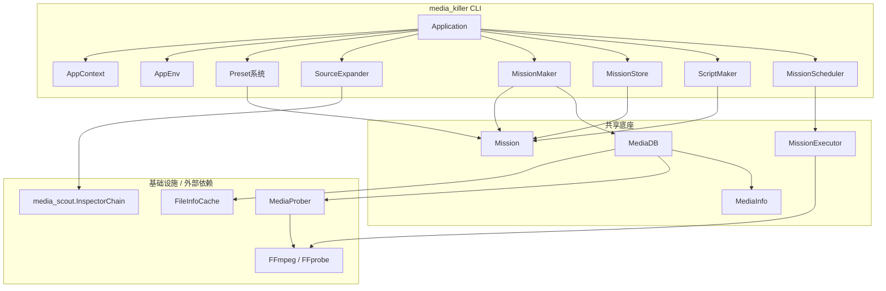
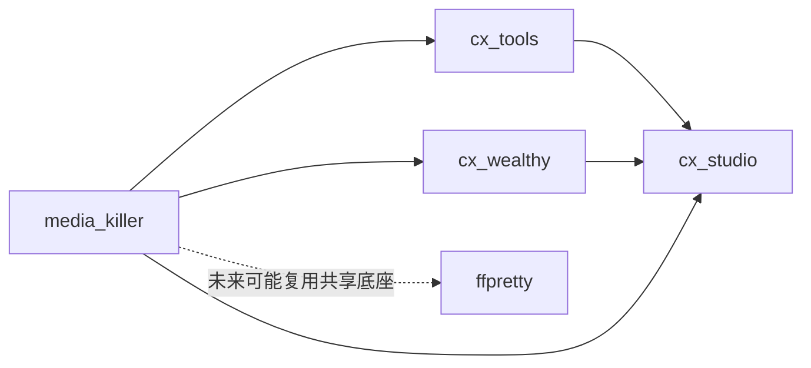

# media_killer 架构设计文档

> 本文档基于 [REFERENCE.md](file:///d:/workspace/cx-studio-tk/packages/cxalio-studio-tools/media_killer/REFERENCE.md) 与 [CLI_BEHAVIOR.md](file:///d:/workspace/cx-studio-tk/packages/cxalio-studio-tools/media_killer/CLI_BEHAVIOR.md)，定义 media_killer 的模块、类与接口划分。
> 它是实现前的设计草案，需经审阅后锁定。

---

## 1. 设计约束

1. **[`Mission`](#41-mission) 是转码的通用契约**。构造完成后自洽，不再引用 [`Preset`](#410-preset-系统) 或 [`SourceExpander`](#411-sourceexpander)。
2. **[`MissionExecutor`](#43-missionexecutor) 不依赖 `appenv`**。进度通过事件发出，中断通过 `cancel()` 方法接收。
3. **[`Preset`](#410-preset-系统) 是 media_killer 私有概念**。生成 [`Mission`](#41-mission) 后退役，不进入共享底座。
4. **CLI 行为锚定 [CLI_BEHAVIOR.md](file:///d:/workspace/cx-studio-tk/packages/cxalio-studio-tools/media_killer/CLI_BEHAVIOR.md)**。内部实现可以调整，外部行为不变。
5. **`FileInfoCache` 在本次范围内重新设计**。现有实现位于 `cx-studio`，目前仅用于 media_killer，但将按通用组件重新设计并保留在 `cx-studio`；[`MediaDB`](#49-mediadb) 继承它并添加媒体特化能力。`media_scout` 只负责项目文件解析，与元数据探测是不同能力。
6. **ffpretty 迁移本次不考虑**。共享底座按“未来可被复用”设计，但当前只服务于 media_killer CLI；ffpretty 的真正迁移留到很久以后单独规划。

---

## 2. 包结构

```
packages/cxalio-studio-tools/media_killer/
├── __init__.py                 # 公开符号聚合
├── appenv.py                   # CLI 专用 AppEnv
├── application.py              # CLI Application
├── appcontext.py               # 命令行参数解析
├── mk_help_info.py             # 帮助信息
│
├── mission/                    # 共享底座：Mission 契约
│   ├── __init__.py
│   ├── mission.py              # Mission 值对象
│   └── specs.py                # InputSpec / OutputSpec
│
├── executor/                   # 共享底座：单 Mission 执行
│   ├── __init__.py
│   ├── executor.py             # MissionExecutor
│   ├── result.py               # MissionResult
│   └── events.py               # 事件名常量 / 进度信息类型
│
├── prober/                     # 共享底座：媒体元数据探测
│   ├── __init__.py
│   ├── media_db.py             # MediaDB（继承 FileInfoCache，调度 MediaProber）
│   ├── media_prober.py         # MediaProber（纯 ffprobe 调用）
│   └── media_info.py           # MediaInfo 值对象
│
├── scheduler/                  # 批处理外壳：批量调度
│   ├── __init__.py
│   └── scheduler.py            # MissionScheduler
│
├── preset/                     # 批处理外壳：Preset 系统
│   ├── __init__.py
│   ├── preset.py               # Preset / InputTemplate / OutputTemplate
│   ├── loader.py               # PresetLoader（解析 + lint）
│   ├── tag_replacer.py         # PresetTagReplacer
│   └── maker.py                # MissionMaker
│
├── source/                     # 批处理外壳：源文件展开
│   ├── __init__.py
│   └── expander.py             # SourceExpander
│
├── persistence/                # 批处理外壳：continue 持久化
│   ├── __init__.py
│   └── mission_store.py        # MissionStore
│
└── script/                     # 批处理外壳：脚本生成
    ├── __init__.py
    └── script_maker.py         # ScriptMaker
```

### 包说明

| 包 | 层级 | 职责 | 主要章节 |
|---|---|---|---|
| `mission` | 共享底座 | 定义转码任务的通用值对象与输入/输出规格。 | [§4.1 Mission](#41-mission)、[§4.2 InputSpec / OutputSpec](#42-inputspec--outputspec) |
| `executor` | 共享底座 | 执行单个 [`Mission`](#41-mission)，管理临时文件、进度事件、取消与 garbage。 | [§4.3 MissionExecutor](#43-missionexecutor)、[§4.4 MissionResult](#44-missionresult)、[§4.5 MissionExecutor 事件](#45-missionexecutor-事件) |
| `prober` | 共享底座 | 封装 `ffprobe` 调用与元数据缓存，提供统一的媒体信息查询入口。 | [§4.6 MediaProber](#46-mediaprober)、[§4.7 MediaInfo](#47-mediainfo)、[§4.9 MediaDB](#49-mediadb) |
| `cx-studio.FileInfoCache` | 外部通用组件 | 通用文件条目缓存机制，位于 `cx-studio`，`MediaDB` 继承它。 | [§4.8 FileInfoCache](#48-fileinfocache) |
| `scheduler` | 批处理外壳 | 管理一批 [`Mission`](#41-mission) 的并发执行与两段式中断。 | [§4.10 MissionScheduler](#410-missionscheduler) |
| `preset` | 批处理外壳 | Preset 加载、lint、标签替换、Mission 生成。 | [§4.11 Preset 系统](#411-preset-系统) |
| `source` | 批处理外壳 | 将命令行输入的源路径展开为最终媒体文件列表。 | [§4.12 SourceExpander](#412-sourceexpander) |
| `persistence` | 批处理外壳 | Mission 列表的持久化，供 `-c/--continue` 使用。 | [§4.13 MissionStore](#413-missionstore) |
| `script` | 批处理外壳 | 将 Mission 列表编译为可独立运行的脚本。 | [§4.14 ScriptMaker](#414-scriptmaker) |

> 共享底座（`mission`、`executor`、`prober`）当前位于 `media_killer` 包内，未来 ffpretty 等工具若需复用，可从这些子包导入。若后续发现循环依赖或语义耦合过重，再考虑拆分为独立包。

---

## 3. 公开与私有边界

### 3.1 公开组件（其它工具可导入）

| 组件 | 路径 | 说明 |
|---|---|---|
| `Mission` | `media_killer.mission.Mission` | 转码任务值对象 |
| `InputSpec` / `OutputSpec` | `media_killer.mission.specs` | Mission 的输入/输出规格 |
| `MissionExecutor` | `media_killer.executor.MissionExecutor` | 执行单个 Mission |
| `MissionResult` | `media_killer.executor.MissionResult` | 执行结果枚举 |
| `MissionExecutor` 事件类型 | `media_killer.executor.events` | 进度、状态、verbose 等事件参数类型 |
| `FileInfoCache` | `cx_studio.filesystem.FileInfoCache` | 通用文件条目缓存机制（MediaDB 的基类） |
| `MediaDB` | `media_killer.prober.MediaDB` | 媒体元数据缓存与查询入口（消费者应直接使用） |
| `MediaProber` | `media_killer.prober.MediaProber` | 底层 ffprobe 调用器（MediaDB 内部使用，也可独立使用） |
| `MediaInfo` | `media_killer.prober.MediaInfo` | 媒体元数据值对象 |

### 3.2 私有组件（仅 media_killer CLI 使用）

| 组件 | 路径 | 说明 |
|---|---|---|
| `Preset` 系统 | `media_killer.preset.*` | Preset 加载、lint、标签替换、生成 Mission |
| `SourceExpander` | `media_killer.source.expander` | 源文件/目录/项目文件展开 |
| `MissionScheduler` | `media_killer.scheduler.scheduler` | 批量任务调度与中断分发 |
| `MissionStore` | `media_killer.persistence.mission_store` | continue 的 Mission 列表持久化 |
| `ScriptMaker` | `media_killer.script.script_maker` | 导出可独立运行的脚本 |
| `AppEnv` / `Application` | `media_killer.appenv` / `media_killer.application` | CLI 入口与生命周期 |

---

## 4. 核心组件设计

### 4.1 Mission

路径：`media_killer/mission/mission.py`

职责：转码任务的通用契约。生成阶段结束后，所有路径已解析为绝对路径，不再依赖 Preset 或源展开器。

```python
@dataclass(frozen=True)
class Mission:
    mission_id: ULID
    ffmpeg: str
    source: Path
    standard_target: Path
    overwrite: bool
    hardware_accelerate: str | None
    options: list[str]
    inputs: list[InputSpec]
    outputs: list[OutputSpec]
    # media_killer 特有的展示元数据，不参与执行逻辑
    preset_id: str | None = None
    preset_name: str | None = None
```

- `ffmpeg`：已解析的 FFmpeg 可执行文件路径。规则见 [CLI_BEHAVIOR.md §9.5](file:///d:/workspace/cx-studio-tk/packages/cxalio-studio-tools/media_killer/CLI_BEHAVIOR.md#95-ffmpeg-路径解析)。
  - 若用户给出绝对路径，直接使用该绝对路径字符串。
  - 若用户给出相对路径（含 `./`），基于 CWD 解析为绝对路径字符串。
  - 若未指定或为空，通过环境 `PATH` 搜索得到可执行文件名（如 `"ffmpeg"`），以字符串形式存储。
  - **最终类型统一为 `str`**，避免 `Path` 与 PATH 搜索结果的命名冲突。
- `inputs[0]` 通常对应 `source`，但允许用户通过 Preset 定义额外输入。
- `outputs` 包含所有输出文件，通常 `outputs[0]` 对应 `standard_target`。
- `preset_id` / `preset_name` 仅用于展示与调试，不参与执行逻辑。
- 所有 `Path` 字段在构造前必须解析为**绝对路径**，保证 Mission 自洽。

### 4.2 InputSpec / OutputSpec

路径：`media_killer/mission/specs.py`

职责：描述 Mission 的输入文件与输出文件及其专属选项。

```python
@dataclass(frozen=True)
class InputSpec:
    filename: Path
    options: list[str]

@dataclass(frozen=True)
class OutputSpec:
    filename: Path
    options: list[str]
```

旧版的 `ArgumentGroup` 是内部解析结构，Mission 中只保留已扁平化的 `list[str]`。

### 4.3 MissionExecutor

路径：`media_killer/executor/executor.py`

职责：给定一个完全解析的 [`Mission`](#41-mission)，创建目录、运行 FFmpeg、报告进度、可被外部取消，并管理临时文件与 garbage。

```python
class MissionExecutor:
    def __init__(
        self,
        mission: Mission,
        ffmpeg_executable: str | None = None,
    ):
        ...

    @property
    def garbage_files(self) -> list[Path]:
        """返回本次执行产生的、需要清理的临时文件路径。"""
        ...

    async def execute(self) -> MissionResult:
        ...

    def cancel(self) -> None:
        ...
```

**FFmpeg 可执行文件优先级**：

`MissionExecutor` 启动 FFmpeg 时，按以下顺序确定使用哪个可执行文件：

1. 构造函数参数 `ffmpeg_executable`（若非空）。
2. `mission.ffmpeg` 字段。
3. 在 `PATH` 中搜索 `"ffmpeg"`。

> `Mission.ffmpeg` 在生成阶段已由 `MissionMaker` 解析完成，因此正常情况下 `MissionExecutor` 直接使用 `mission.ffmpeg` 即可。`ffmpeg_executable` 参数用于测试或特殊场景覆盖。

执行流程：

```
检查目标目录 → 创建目标目录（若不存在）
    ↓
计算临时文件路径 mk2tmp.<target_filename>
    ↓
将临时文件加入 garbage_files
    ↓
启动 FFmpeg，输出指向临时文件（不传递 -y/-n）
    ↓
成功 → 原子重命名临时文件到 standard_target
        → 从 garbage_files 移除该临时文件
失败/取消 → 保留临时文件在 garbage_files 中
```

约束：
- 不 import `appenv`。
- 输出目录在 `execute()` 中创建（生成阶段不创建）。
- 临时文件使用前缀式命名 `mk2tmp.<target_filename>`，与目标文件同目录。
- 覆盖决策由调用方在启动前完成，执行阶段不再向 FFmpeg 传递 `-y`/`--no-overwrite`。

### 4.4 MissionResult

路径：`media_killer/executor/result.py`

```python
class MissionResult(Enum):
    SUCCESS = "success"
    FAILED = "failed"
    CANCELED = "canceled"
```

未来可扩展为 dataclass，携带错误信息、耗时等。

### 4.5 MissionExecutor 事件

路径：`media_killer/executor/events.py`

`MissionExecutor` 通过事件发射器（pyee）向外报告进度与状态：

| 事件名 | 参数 | 含义 |
|---|---|---|
| `started` | 无 | FFmpeg 进程已启动 |
| `progress_updated` | `current: CxTime, total: CxTime \| None` | 进度更新 |
| `status_updated` | `coding_info: FFmpegCodingInfo` | 帧率、速度等状态更新 |
| `finished` | 无 | 转码成功完成 |
| `failed` | `reason: str` | 转码失败 |
| `canceled` | 无 | 被外部取消 |
| `verbose` | `line: str` | FFmpeg 原始 stderr 行 |

### 4.6 MediaProber

路径：`media_killer/prober/media_prober.py`

职责：底层媒体元数据探测器，只负责从单个文件调用 `ffprobe` 获取原始元数据。它不维护缓存，也不关心调用方是谁。

```python
class MediaProber:
    def __init__(
        self,
        ffprobe_executable: str | Path | None = None,
    ):
        ...

    def probe(self, file: Path) -> MediaInfo:
        ...
```

> 普通消费者不应直接使用 `MediaProber`，而应通过 [`MediaDB`](#49-mediadb) 获取元数据。
>
> `MediaProber` 不维护缓存，也不内部持锁；它支持并发运行，但是否并发由 `MediaDB` 控制。

### 4.7 MediaInfo

路径：`media_killer/prober/media_info.py`

职责：承载 `ffprobe` 解析后的媒体元数据。具体字段在实现阶段根据旧版需求和 `ffprobe` 输出确定，保持为 frozen dataclass。

### 4.8 FileInfoCache

路径：`cx_studio/filesystem/file_info_cache.py`（位于 `cx-studio` 包）

职责：通用文件条目缓存机制。以文件路径为 key，基于文件 `mtime` 自动失效，持久化到 SQLite。本身不感知媒体语义，可被任何需要按文件缓存数据的工具使用。

```python
class FileInfoCache:
    def __init__(
        self,
        db_path: Path,
        max_size: int = -1,
    ):
        ...

    def get(self, file_path: Path) -> dict | None:
        ...

    def set(self, file_path: Path, data: dict) -> None:
        ...

    def invalidate(self, file_path: Path) -> None:
        ...

    def close(self) -> None:
        ...
```

设计要点：
- 轻量便利设施，不追求成为通用完美缓存器；目标是动态控制、快速启动、够用即可。
- 存储结构化为 JSON 的 `dict`，不强制字段 schema，由上层（如 `MediaDB`）决定具体结构。
- 缓存 key 使用**规范化后的绝对路径**（如 `Path.resolve()`），不采用哈希摘要，保证可读性与无冲突。
- 运行时仅做单条 `mtime` 校验，无效则返回 `None`。
- 线程安全：`FileInfoCache` 是同步类，使用 `threading.Lock` 保护 SQLite 操作。
- 生命周期：`__init__` 只保存配置；`connect()` / `__enter__` 建立连接并建表；`close()` / `__exit__` 执行淘汰清理并关闭连接；不再依赖 `__del__`。

> 这是旧版 `cx_studio.filesystem.cx_file_info_cache` 的重新设计版本，保留在 `cx-studio` 中作为通用组件。

### 4.9 MediaDB

路径：`media_killer/prober/media_db.py`

职责：媒体元数据的统一提供者。继承 [`FileInfoCache`](#48-fileinfocache)，需要时调度 [`MediaProber`](#46-mediaprober) 获取新数据；所有消费者都从这里拿数据，不感知数据来自缓存还是新探测。

```python
class MediaDB(FileInfoCache):
    def __init__(self, db_path: Path, prober: MediaProber | None = None):
        ...

    def get_media_info(self, file: Path) -> MediaInfo:
        ...
```

流程：

```
查询 file → FileInfoCache 命中 → 返回 MediaInfo
                └─ 未命中 → 调 MediaProber → 回填 FileInfoCache → 返回
```

> **生命周期**：运行时需要单个全局 `MediaDB` 实例，由 CLI / `AppEnv` 在实例化时指定 `db_path`，并在进入/退出时调用 `connect()` / `close()`。`MediaDB` 不硬编码数据库位置。
>
> **同步设计**：`MediaDB` 是同步类；缓存查询开销很小，同步阻塞可接受。若上层（如 `MissionScheduler`）在异步环境中需要调用，由上层自行决定如何调度。
>
> **`ffprobe` 并发控制**：`MediaDB` 负责控制是否并发调用 `MediaProber`。媒体元数据探测开销大且会争用 I/O，`MediaDB` 默认串行调用 `MediaProber`（例如通过内部锁或单线程消费者模式）。`MediaProber` 本身不持锁，支持并发运行。
>
> **非媒体文件与失败处理**：`MediaDB.get_media_info(file) -> MediaInfo | None`。返回 `None` 表示文件存在但非媒体文件，此时 `FileInfoCache` 中仍保留一条记录，只是 `user_data` 无媒体元数据。`ffprobe` 失败通过异常暴露，不缓存。

### 4.10 MissionScheduler

路径：`media_killer/scheduler/scheduler.py`

职责：管理一批 [`Mission`](#41-mission) 的并发执行，并分发两段式中断。

```python
class MissionScheduler:
    def __init__(
        self,
        missions: Iterable[Mission],
        max_workers: int = 1,
        executor_factory: Callable[[Mission], MissionExecutor] | None = None,
    ):
        ...

    async def run(self) -> list[MissionResult]:
        ...

    def stop_accepting_new(self) -> None:
        """第一次 Ctrl+C：不再取新任务，当前任务继续。"""
        ...

    def cancel_all(self) -> None:
        """第二次 Ctrl+C：取消所有在跑任务。"""
        ...
```

聚合后发出的事件：

| 事件名 | 参数 |
|---|---|
| `mission_started` | `index: int, mission: Mission` |
| `mission_progress` | `index: int, info: ProgressInfo` |
| `mission_finished` | `index: int, result: MissionResult` |
| `all_finished` | `results: list[MissionResult]` |

CLI 层在创建 Scheduler 后挂接中断：

```python
@appenv.interrupt_handler.on("first_triggered")
def _on_first():
    scheduler.stop_accepting_new()

@appenv.interrupt_handler.on("second_triggered")
def _on_second():
    scheduler.cancel_all()
```

Scheduler 在每个 Mission 结束后收集对应 [`MissionExecutor`](#43-missionexecutor) 的 `garbage_files`，最终统一交给 CLI 层清理。

### 4.11 Preset 系统

路径：`media_killer/preset/`

#### 4.11.1 Preset

路径：`media_killer/preset/preset.py`

```python
@dataclass(frozen=True)
class InputTemplate:
    filename: str      # 模板字符串
    options: list[str] # 模板字符串

@dataclass(frozen=True)
class OutputTemplate:
    filename: str
    options: list[str]

@dataclass(frozen=True)
class Preset:
    id: str
    name: str
    description: str
    path: Path
    ffmpeg: str
    overwrite: bool
    hardware_accelerate: str | None
    options: list[str]
    source_suffixes: set[str]
    target_suffix: str
    target_folder: Path
    keep_parent_level: int
    inputs: list[InputTemplate]
    outputs: list[OutputTemplate]
    custom: dict[str, Any]
```

与旧版区别：
- 去掉 `raw: Box` 透传。
- `inputs` / `outputs` 是强类型 `InputTemplate` / `OutputTemplate`，不是 `list[Box]`。

#### 4.11.2 PresetLoader

路径：`media_killer/preset/loader.py`

```python
class PresetLoader:
    def load(self, path: Path) -> Preset:
        ...
```

流程：

```
读取 TOML → lint 结构与标签 → 构造 Preset
```

lint 与标签替换共用同一套标签解析内核（见 REFERENCE 9.5）。

#### 4.11.3 PresetTagReplacer

路径：`media_killer/preset/tag_replacer.py`

职责：将 Preset 中的模板字符串替换为实际路径与参数。

- 不依赖全局 `appenv`。
- 输入为 `Preset` + `source` + `output_dir`，输出为替换后的字符串。
- 路径锚点策略遵循 [CLI_BEHAVIOR.md §9](file:///d:/workspace/cx-studio-tk/packages/cxalio-studio-tools/media_killer/CLI_BEHAVIOR.md#9-路径锚点)：
  - `[[input]]` 的相对路径：预设文件位置优先，CWD 兜底。
  - `[[output]]` 的相对路径：基于 Mission 输出目录。
  - 模板替换先完成，再对结果判断是否需要锚点解析。

#### 4.11.4 MissionMaker

路径：`media_killer/preset/maker.py`

```python
class MissionMaker:
    def __init__(self, preset: Preset, media_db: MediaDB):
        ...

    def make_mission(
        self,
        source: Path,
        output_dir: Path | None = None,
        force_overwrite: bool | None = None,
        force_no_overwrite: bool | None = None,
    ) -> Mission:
        ...
```

职责：
- 根据需要用 [`MediaDB`](#49-mediadb) 获取源文件元数据。
- 用 [`PresetTagReplacer`](#4113-presettagreplacer) 替换标签（元数据变量如 `${source:duration}` 依赖上一步结果）。
- 根据命令行 `-y/-n` 覆盖 Preset 的 `overwrite`。
- 解析所有相对路径，构造路径全为绝对的自洽 [`Mission`](#41-mission)。

### 4.12 SourceExpander

路径：`media_killer/source/expander.py`

职责：将命令行输入的源路径展开为最终媒体文件列表。

```python
class SourceExpander:
    def __init__(
        self,
        suffixes: set[str],
        scout_chain: InspectorChain | None = None,
    ):
        ...

    def expand(self, *paths: str | Path) -> Generator[Path]:
        ...
```

处理顺序：

1. **项目文件解析**：EDL、FCP XML、DaVinci CSV、纯文本列表等项目文件，调用 `media_scout.InspectorChain` 解析，按项目文件所在目录为锚点解析内部路径。
2. **目录递归**：若路径是目录，递归展开其中所有文件。
3. **后缀过滤**：按 `suffixes` 过滤，只保留匹配的媒体文件。

**与 Preset 的关系**：

- `SourceExpander` 本身不加载 Preset，只接收一个合并后的 `suffixes` 集合。
- `Application` 在调用 `SourceExpander` 之前，必须先加载所有 Preset，并将它们的 `source_suffixes` 取并集传给 `SourceExpander`。
- 这意味着**源文件展开必须在 Preset 加载之后进行**，而不是与 Preset 加载并行。

路径锚点：
- 命令行输入的相对路径基于 CWD 解析（见 [CLI_BEHAVIOR.md §9.1](file:///d:/workspace/cx-studio-tk/packages/cxalio-studio-tools/media_killer/CLI_BEHAVIOR.md#91-命令行输入路径)）。
- 项目文件解析是 `media_scout` 的核心能力，`SourceExpander` 只负责触发解析与收集结果，不将具体实现搬到 media_killer。

> `SourceExpander` 本身不探测文件内容，项目文件解析由 `media_scout` 独立完成。

### 4.13 MissionStore

路径：`media_killer/persistence/mission_store.py`

职责：持久化 Mission 列表，供 `-c/--continue` 使用。

```python
class MissionStore:
    def save(self, path: Path, missions: Iterable[Mission]) -> None:
        ...

    def load(self, path: Path) -> list[Mission]:
        ...
```

- 第一版沿用 XML，保持与旧版 `last_missions.xml` 兼容。
- 因 Mission 内部路径均为绝对路径，continue 文件中自然保存绝对路径。

### 4.14 ScriptMaker

路径：`media_killer/script/script_maker.py`

职责：将 Mission 列表编译为可独立运行的脚本。

- 输入为 [`Mission`](#41-mission) 列表。
- 输出为 batch/shell 脚本，包含完整的 ffmpeg 命令序列。
- 脚本中直接使用 Mission 的最终目标文件名（不体现 `mk2tmp.` 临时文件机制）。

---

## 5. 数据流



> `FileInfoCache` 位于 `cx-studio`，按通用组件重新设计；`MediaDB` 继承它作为持久化缓存层。共享底座以上的组件不感知这一变化。

---

## 6. 依赖方向



> 旧版 `media_killer` 与 `ffpretty` 平级；新版 `media_killer` 的共享底座按“可被 ffpretty 未来复用”设计，但本次不执行 ffpretty 迁移。若未来耦合过重，再考虑将共享底座拆分为独立包。

---

## 7. 已确认决策

以下决策已在讨论中确认，不再作为待决策项：

| 事项 | 决策 |
|---|---|
| continue 格式 | 沿用 XML，保持与旧版 `last_missions.xml` 兼容。 |
| garbage 文件范围 | 限定为 [`MissionExecutor`](#43-missionexecutor) 已登记的临时文件；成功重命名后不再属于 garbage。 |
| 临时文件命名 | 前缀式 `mk2tmp.<target_filename>`，与目标文件同目录。 |
| 去重规则 | 按 `(source, preset_id)` 去重。 |
| 排序规则 | `source` / `preset` / `target` / `x`，沿用旧版。 |
| 脚本保存格式 | 生成可独立运行的 batch/shell 脚本。 |
| 路径锚点策略 | 分层锚点：CLI 输入基于 CWD；preset input 基于预设位置优先、CWD 兜底；preset output 基于 Mission 输出目录；项目文件内部路径基于项目文件位置。 |
| Mission 是否含 `preset_id`/`preset_name` | 保留，用于去重、来源追踪、排序与界面提示。 |
| FileInfoCache 范围 | 纳入本次范围，与 `MediaDB` 一起实现；保留在 `cx-studio` 中按通用组件重新设计。 |
| 本次不迁移 ffpretty | 共享底座按未来可复用设计，但当前任务范围仅限 media_killer CLI。 |

---

## 8. 仍待决策事项

| 事项 | 当前草案 | 需要确认 |
|---|---|---|
| 无 | — | — |

---

## 9. 关键设计决策与被否决方案

以下每项记录**选定方案**、**被否决的替代方案**及**否决理由**。

### 9.1 共享底座放在 `media_killer` 包内

**选定方案**：Mission、MissionExecutor、MediaProber 等共享组件放在 `media_killer` 包内，未来 ffpretty 等工具从 `media_killer.xxx` 导入。

**被否决的替代方案**：

- **放在 `cx_studio` 中**：`cx_studio` 是通用基础设施，不应包含媒体转码这种业务领域概念。
- **放在 `cx_tools` 中**：`cx_tools` 是 CLI 应用框架， Mission 是领域模型，不是框架能力。
- **新建独立包 `cx_media` 或 `cx_ffmpeg_tools`**：方向正确，但当前工具集规模下会增加包管理、版本联动和构建复杂度。先放在 `media_killer` 内验证边界，必要时再拆包。

**理由**：按 REFERENCE 设计，`media_killer` 本身就是“共享底座 + 批处理外壳”。先内聚、后拆分，避免过早抽象。

### 9.2 Mission 作为通用契约

**选定方案**：`Mission` 是完全解析的 frozen dataclass，字段为执行一次转码所需的最小集合；`preset_id` / `preset_name` 作为可选元数据保留。

**被否决的替代方案**：

- **Mission 保留 Preset 引用**：会破坏“生成阶段与执行阶段解耦”，执行单元需要知道 Preset 细节，无法被 ffpretty 独立使用。
- **Mission 完全移除 `preset_id`/`preset_name`**：展示任务来源时需要额外维护映射表，增加 CLI 层负担。
- **把 `preset_id`/`preset_name` 放进 `custom` 字典**：失去类型边界，字段名写错要到运行时才暴露。

**理由**：Mission 是跨工具契约，字段必须自洽且类型安全；同时保留少量展示用元数据，不影响执行逻辑。

### 9.3 MissionExecutor 通过 pyee 事件报告进度

**选定方案**：`MissionExecutor` 继承或使用 `pyee` 事件发射器，通过事件名向外报告进度、状态和 verbose 输出。

**被否决的替代方案**：

- **回调函数接口**：一对一，难以同时支持进度条、日志、统计等多个监听者。
- **async generator 返回进度片段**：调用方需要显式 `async for` 消费，与 `FFmpegAsync` 现有事件模型不一致；且取消语义表达不如 `cancel()` 方法直接。
- **直接操作 progress / console**：会让执行单元依赖 appenv，破坏复用前提。

**理由**：pyee 事件模型与 `FFmpegAsync` 一致，天然支持多监听者；`cancel()` 方法作为单一指令入口，方向清晰。

### 9.4 MissionExecutor 不依赖 appenv

**选定方案**：`MissionExecutor` 所需的一切通过构造参数传入，不 import `appenv`。

**被否决的替代方案**：

- **执行单元直接 import appenv 获取 progress / console**：这是旧版 `MissionRunner` 和 ffpretty `Transcoder` 的做法，导致无法单独测试和复用。
- **执行单元接收一个抽象的输出接口**：虽然比 appenv 好，但仍暗示执行单元知道“谁在消费进度”，不如事件模型解耦彻底。

**理由**：执行单元只负责“跑一个 Mission 并发出事件”，不关心外面有没有 UI、有几个监听者。

### 9.5 MissionExecutor 的临时文件机制

**选定方案**：`MissionExecutor` 在与目标文件同目录下创建前缀式临时文件 `mk2tmp.<target_filename>`，FFmpeg 成功退出后原子重命名为最终目标文件；失败、取消或中断时保留临时文件作为 garbage。

**被否决的替代方案**：

- **直接覆盖目标文件**：失败或中断时会留下部分覆盖的损坏文件，且无法区分“已完成”与“未完成”输出。
- **后缀式临时文件（如 `x.new.mp4`）**：改变文件扩展名，可能干扰 FFmpeg 的自动封装格式推断。
- **中缀式临时文件（如 `x.mk2tmp.mp4`）**：需要拆分文件名主体与扩展名，原始文件名中间可能包含 `.`，插入位置不可靠。
- **放在系统临时目录**：跨文件系统 move/rename 可能非原子，且失败时需要额外拷贝；用户也无法直观看到临时文件。
- **使用随机 token（如 `x.mp4.a1b2c3`）**：遗留文件不可读，用户难以识别归属。

**理由**：前缀方案不改变扩展名、不拆分文件名、遗留文件归属清晰；原子重命名保证最终输出只有“不存在”或“完整”两种状态。

### 9.6 garbage 清理范围

**选定方案**：garbage 清理范围限定为 [`MissionExecutor`](#43-missionexecutor) 已登记的临时文件。Mission 成功则临时文件已重命名，无 garbage；失败、取消或中断则清理登记的临时文件。

**被否决的替代方案**：

- **按 FFmpeg 是否启动判断 garbage**：无法覆盖进程崩溃在重命名前的情况，且“是否启动”边界不可靠。
- **失败/取消时删除该 Mission 全部输出文件**：会误删本次运行前就已存在的文件。
- **记录 Mission 启动前不存在的文件，仅删这些**：需要做文件系统快照，实现复杂且容易遗漏。
- **从不清理**：会留下半成品文件，污染输出目录。

**理由**：临时文件机制将“未完成输出”与“最终输出”物理隔离，任何遗留的临时文件都是未成功提交的任务输出，可以安全删除。

### 9.7 media_scout 作为项目文件解析核心实现者

**选定方案**：EDL、FCP XML、DaVinci CSV、纯文本列表等项目文件解析的核心实现保留在 `media_scout`。`media_killer` 的 [`SourceExpander`](#411-sourceexpander) 通过 `media_scout.InspectorChain` 调用其能力，不将项目解析逻辑搬到 media_killer。

**被否决的替代方案**：

- **将项目解析逻辑归集到 media_killer**：会让 `media_scout` 沦为壳子，违反领域边界；且多个工具都需要项目解析能力时会造成重复实现。
- **media_killer 直接 import `media_scout.inspectors` 内部模块**：虽然复用了 `media_scout` 代码，但穿透其内部结构，耦合过深。

**理由**：`media_scout` 已经是工具集共享的项目文件解析能力中心，其核心实现应持续沉淀在那里。media_killer 只需通过稳定的高层接口复用。

### 9.8 MediaDB 作为 media_killer 的媒体信息唯一入口

**选定方案**：media_killer 内所有媒体元数据消费者（如 [`MissionMaker`](#4114-missionmaker)）都只与 [`MediaDB`](#49-mediadb) 交互。`MediaDB` 继承 [`FileInfoCache`](#48-fileinfocache)，需要时调度 [`MediaProber`](#46-mediaprober) 获取新数据。

**被否决的替代方案**：

- **消费者直接调用 `MediaProber`**：没有统一缓存层，会导致同一文件被多次探测。
- **消费者直接调用 ffprobe**：重复探测同一文件，浪费 I/O；且各工具解析格式不一致。
- **让 `media_scout` 承担 ffprobe 元数据探测**：`media_scout` 当前只解析项目文件，没有 ffprobe 探测能力；强行扩展会让其职责混乱。

**理由**：`MediaDB` 作为统一入口，将“缓存策略”与“探测实现”解耦；`FileInfoCache` 负责通用文件条目缓存，`MediaDB` 负责调度 `MediaProber` 与处理 `MediaInfo` 等媒体特化能力。

### 9.9 MediaProber 作为纯底层 ffprobe 调用器

**选定方案**：`MediaProber` 只负责从单个文件调用 `ffprobe` 获取元数据，不维护缓存，不感知消费者。缓存与调度由 `MediaDB` 负责。

**被否决的替代方案**：

- **`MediaProber` 内部同时承担缓存职责**：会让探测器和缓存策略耦合，替换缓存实现时需要改动探测器。
- **`MediaProber` 同时作为消费者入口**：名字里的“Prober”暗示它只是探测器，若让消费者直接调用，容易绕过缓存层。

**理由**：职责分离后，`MediaProber` 可以独立测试和复用；`MediaDB` 可以灵活演进缓存策略，不影响探测逻辑。

### 9.10 FileInfoCache 在本次范围内重新设计

**选定方案**：`FileInfoCache` 不再推迟到未来，而是与 `MediaDB` 一起在本次实现。它在 `cx-studio` 中按通用组件重新设计并保留；`MediaDB` 继承它。

**被否决的替代方案**：

- **把 `FileInfoCache` 做成复杂通用缓存器**：网上已有大量优秀缓存实现，`FileInfoCache` 只需是 `cx-studio` 内的轻量便利设施，过度设计反而增加维护负担。
- **继续使用 `cx-studio` 中的旧 `FileInfoCache` 不做修改**：存在类型不安全、异步适配差等问题。
- **完全推迟到未来专项讨论**：会导致本次 `MediaDB` 先实现临时内存缓存，未来又要重构接入 `FileInfoCache`，产生重复工作。
- **`MediaDB` 自己实现持久化缓存，不依赖通用 `FileInfoCache`**：持久化缓存逻辑与媒体语义耦合，未来其它工具需要文件缓存时会重复实现。
- **把 `FileInfoCache` 放到 `media_killer` 内部**：虽然当前只有 media_killer 使用，但它本身是通用文件缓存机制，放在 `cx-studio` 更符合其定位，也便于未来复用。

**理由**：`FileInfoCache` 目前仅用于 media_killer，但本身是通用能力；在 `cx-studio` 中重新设计并保留，既满足本次需求，也避免未来迁移。保持轻量、动态控制、快速启动、够用即可；生命周期通过显式 `connect()` / `close()` 管理，不再依赖 `__del__`，避免 Python 退出阶段 `sqlite3` 已卸载导致的问题。

### 9.11 Preset 使用 dataclass 而非 pydantic / Box

**选定方案**：`Preset` 及其子结构使用 `@dataclass(frozen=True)`。

**被否决的替代方案**：

- **pydantic**：太重，循环预处理阶段不灵活；旧版最初用 pydantic，后因此替换为 Box。
- **Box**：无类型，`inputs`/`outputs` 是 `list[Box]`，字段名写错到运行时才暴露；`raw: Box` 导致原始 TOML 全程透传。
- **裸 `dict`**：比 Box 更差，连属性访问便利性都没有。

**理由**：dataclass 提供类型边界，能挡住字段名错误和类型错误，同时没有框架负担。

### 9.12 MissionScheduler 两段式中断

**选定方案**：第一次 `Ctrl+C` 调用 `stop_accepting_new()`，调度器不再从队列取出新 Mission，当前正在执行的 Mission 继续运行至自然完成；第二次 `Ctrl+C` 调用 `cancel_all()`，清空队列并取消所有正在执行的 Mission，全局中止。

**被否决的替代方案**：

- **第一次 `Ctrl+C` 直接取消当前任务、队列继续**：用户可能只是想暂停观察或临时改变主意，误触成本过高；强制中断 FFmpeg 可能导致输出文件不完整。
- **第一次 `Ctrl+C` 直接全局中止**：与“两段式”初衷矛盾，无法区分“不再继续”和“立即停止”两种用户意图。
- **第一次 `Ctrl+C` 后进入可恢复的暂停状态**：需要额外的“继续”命令或按键，CLI 交互变复杂；旧版无此需求。
- **每个执行单元各自监听 SIGINT**：会导致执行单元和调度器都收到信号，取消路径混乱。

**理由**：两段式语义是真实 UX 需求；第一次中断只“止血”，第二次才是明确“放弃”；信号只挂调度器，调度器再分发 `cancel()`，路径清晰。

---

## 10. 下一步工作建议

按依赖顺序，建议分阶段实现：

1. **Mission + InputSpec/OutputSpec + MissionResult**：确定通用契约字段。
2. **MissionExecutor**：基于 `FFmpegAsync` 封装，实现临时文件机制与 garbage 登记，不依赖 appenv。
3. **FileInfoCache（`cx-studio`）+ MediaProber + MediaInfo + MediaDB**：在 `cx-studio` 中重新设计 `FileInfoCache`；`MediaProber` 直接封装 `ffprobe`；`MediaDB` 继承 `FileInfoCache` 并调度 `MediaProber`。
4. **MissionScheduler**：实现两段式中断分发与 garbage 收集。
5. **Preset 系统**：dataclass + loader + lint + tag replacer。
6. **SourceExpander / MissionMaker**：`SourceExpander` 通过 `media_scout` 解析项目文件并展开源路径；`MissionMaker` 基于 [`MediaDB`](#49-mediadb) 获取元数据并生成绝对路径的 [`Mission`](#41-mission)。
7. **MissionStore / ScriptMaker**：CLI 外壳收尾。
8. **Application / AppEnv / AppContext**：对接 [CLI_BEHAVIOR.md](file:///d:/workspace/cx-studio-tk/packages/cxalio-studio-tools/media_killer/CLI_BEHAVIOR.md)。

> ffpretty 迁移不在本次实现范围内，留待后续专项讨论。
