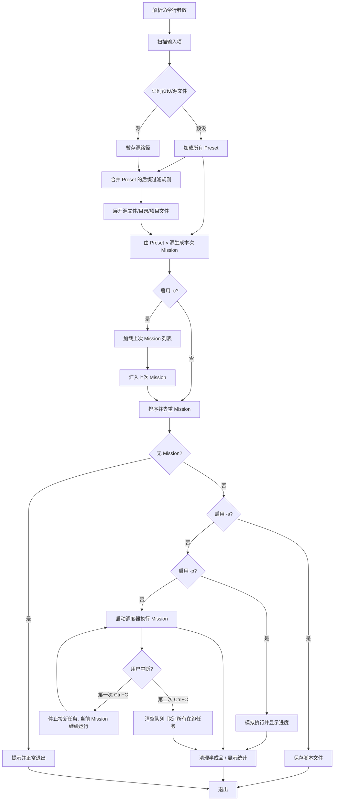

# media_killer CLI 行为文档

> 本文档锚定 media_killer 必须完整、准确复现的用户侧行为。
> 它从旧版 `media_killer` 的实际运行表现和 `REFERENCE.md` 的设计意图中提取，
> 不依赖具体实现方式。

---

## 1. 调用方式

```bash
mediakiller [选项] [输入项...]
```

- `输入项` 是**预设文件**（`.toml`）或**源文件/目录/项目文件**的任意混合。
- 至少提供一个输入项，或一个操作选项（如 `-g`、`-h`），否则报错退出。
- 所有用户提示走 `stderr`。`mediakiller` 当前没有需要走 `stdout` 的数据类输出。

---

## 2. 总体执行流程



流程说明：

1. **解析命令行参数**：处理 `-y/-n/-o/-j/-p/-c/-s` 等选项。
2. **扫描输入项**：区分预设文件（`.toml`）和源文件/目录/项目文件。
3. **加载 Preset**：先加载所有 Preset；预设加载失败立即报错退出。
4. **展开源文件**：**必须在 Preset 加载完成后执行**，因为 `SourceExpander` 需要合并所有 Preset 的 `source_suffixes` 作为后缀过滤规则。源文件不存在立即报错退出。
5. **生成本次 Mission**：由 Preset × 源文件生成本次 Mission 列表。
6. **Continue 叠加**：若启用 `-c`，将上次 Mission 列表汇入本次 Mission 列表。
7. **排序去重**：对合并后的全部 Mission 按 `--sort` 参数排序，并按 `(source, preset_id)` 去重。
8. **脚本保存 / 模拟运行 / 实际执行**：三种互斥退出路径。
9. **两段式中断**：执行阶段第一次 `Ctrl+C` 停止接受新任务，当前在跑任务继续运行至结束；第二次 `Ctrl+C` 清空队列并取消所有在跑任务，全局停止。
10. **清理与统计**：`appenv.stop()` 时清理 garbage 文件，显示总大小与耗时。

---

## 3. 命令行选项

| 短选项 | 长选项 | 参数 | 作用 |
|---|---|---|---|
| `-g` | `--generate` | `PRESET...` | 生成示例预设文件，不执行转码 |
| `-s` | `--save` | `FILE` | 将生成的任务保存为脚本，不执行转码 |
| `-c` | `--continue` | 无 | 加载上次运行的全部任务，叠加到本次任务中 |
| `-o` | `--output` | `DIR` | 指定统一的输出目录，覆盖预设中的目标目录 |
|  | `--sort` | `source\|preset\|target\|x` | 任务排序方式，默认 `x`（输入顺序） |
| `-j` | `--jobs` / `--max-workers` | `NUM` | 并行执行单元数，默认 `1` |
| `-y` | `--overwrite` | 无 | 强制覆盖已有输出文件 |
| `-n` | `--no-overwrite` | 无 | 强制安全模式，绝不覆盖已有输出文件 |
| `-p` | `--pretend` | 无 | 模拟运行，不实际调用 FFmpeg 写文件 |
| `-d` | `--debug` | 无 | 显示调试信息 |
| `-h` | `--help` | 无 | 显示帮助 |
|  | `--tutorial` / `--full-help` | 无 | 显示完整教程 |

### 覆盖语义

- 默认情况下是否覆盖由**预设文件**中的 `overwrite` 字段决定。
- `-y` 与 `-n` 互斥；若同时出现，以命令行最后出现的为准（或按 argparse 解析结果处理）。
- `-n` 的优先级高于 `-y`。

---

## 4. 输入项识别规则

`mediakiller` 不区分“预设文件”和“源文件”的位置，统一从输入项中识别。

### 4.1 预设文件判定

满足以下任一条件即视为预设文件：

1. 文件扩展名为 `.toml`。
2. 文件无扩展名，且同目录下存在 `同名.toml` 文件。

判定为预设文件后，调用预设加载逻辑；加载失败立即报错退出，不继续扫描其它输入。

### 4.2 源文件判定

其余所有输入项视为源文件/源目录/源项目文件。

### 4.3 源文件展开规则

对每个源文件路径，按以下顺序处理：

1. **项目文件解析**：若文件类型为以下之一，使用媒体项目解析能力展开为底层媒体文件路径：
   - EDL 剪辑决定表（`.edl`）
   - Final Cut Pro 7 XML（`.xml`）
   - Final Cut Pro XML 项目（`.fcpxml`、`.fcpxmld`）
   - DaVinci Resolve 媒体元数据 CSV（`.csv`）
   - 包含路径列表的纯文本（`.txt`、`.sh` 等）

2. **目录递归**：若路径是目录，递归展开其中所有文件。

3. **后缀过滤**：将展开后的文件按预设中 `source_suffixes` 过滤，只保留匹配的媒体文件。

> 注：项目文件解析能力由工具集共享的媒体元数据/项目解析组件提供，不是 media_killer 私有实现。

---

## 5. 执行阶段与用户可见输出

### 5.1 启动阶段

1. 显示 banner：
   - 工具名称 `MediaKiller`
   - 当前版本号
   - 应用描述
   - 当前模式标签（如“模拟运行”“安全模式”“强制覆盖模式”）
2. 若处于 debug 模式，显示调试信息。

### 5.2 输入扫描阶段

工具逐个处理输入项：

- 识别为预设文件的，加载并显示：`配置文件路径 <path>`
- 识别为源文件的，显示：`媒体来源路径 <path>`

完成后统一报告：

```
已添加 {preset_count} 个配置文件和 {source_count} 个来源路径。
```

### 5.3 任务生成阶段

1. 对每个预设 × 每个源文件，生成 Mission（本次任务）。
   - 若指定了 `m` 个源文件和 `n` 个预设文件，理论上生成 `m × n` 个 Mission。
   - 生成过程中按 `-o` 指定的输出目录替换预设中的目标目录。

2. 若启用 `-c/--continue`：
   - 从持久化存储加载上次全部 Mission。
   - 显示：`从上次执行中恢复了 {count} 个任务……`
   - 这些 Mission **叠加**到本次任务列表，不是替换。

3. 完成显示：`生成了 {count} 个任务。`

4. 对全部 Mission 排序并去重：
   - 若去重后有减少，显示过滤提示。
   - 否则显示：`全部任务整理完毕，已按照设定方式排序。`

5. 若没有任何 Mission，提示用户并正常退出。

### 5.4 脚本保存模式

若启用 `-s/--save FILE`：

- 不执行转码。
- 将当前全部 Mission 编译为脚本文件写入 `FILE`。
- 完成后退出。

### 5.5 模拟运行模式

若启用 `-p/--pretend`：

- 显示：`检测到假装模式，将不会真正执行任何操作。`
- 不调用 FFmpeg，不创建目录，不写文件。
- 仍执行输入校验、输出冲突检查、目录存在性检查。
- 用伪造进度模拟每个 Mission 的执行过程，保持用户界面时序一致。

### 5.6 转码执行阶段

1. 显示总进度条和每个 Mission 的子进度条（`transient=True`，执行结束后自动消失）。
2. 执行期间，每个 Mission 的子进度条显示：
   - 任务编号 / 总数
   - 当前速度
   - 源文件名
   - 状态：开始 / 转码中
3. **MissionExecutor 内部临时文件机制**：
   - Mission 本身不感知临时文件，目标文件名保持为最终输出路径。
   - `MissionExecutor` 执行时，实际先输出到与目标文件同目录的临时文件（如 `mk2tmp.x.mp4`）。
   - FFmpeg 成功退出后，将临时文件原子重命名为最终目标文件（`x.mp4`）。
   - 失败、取消或 `MissionExecutor` 自身被中断时，临时文件作为 garbage 提交统一清理。
   - 由于临时文件在开始时必然不存在，执行阶段**不再向 ffmpeg 传递 `-y`/`--no-overwrite`**；覆盖与否的决策已在任务启动前完成。
4. Mission 完成后，进度条已消失，以普通 console 文字行输出结果：
   - 成功：`完成`
   - 失败：`运行异常`
   - 取消：`被取消`

### 5.7 结束阶段

`appenv.stop()` 触发：

1. 清理失败、被取消或中断的 Mission 产生的 garbage 文件。
   - garbage 主要指 `MissionExecutor` 创建的临时输出文件（如 `mk2tmp.x.mp4`）。
   - `MissionExecutor` 在启动临时文件前、运行中以及被取消时，都应将已创建的临时文件路径登记到 garbage 集合。
   - 最终目标文件（如 `x.mp4`）在成功重命名前不会被创建或覆盖，因此无需作为 garbage 清理。
2. 若输入/输出文件总大小大于 0，显示总大小。
3. 若运行时间超过 5 秒，显示总耗时。

---

## 6. 中断语义

media_killer 使用两段式中断：

| 操作 | 语义 |
|---|---|
| 第一次 `Ctrl+C` | **停止接受新任务**：调度器不再从队列取出新 Mission；当前正在执行的 Mission 继续运行，直至其自然完成。队列中剩余任务保持排队状态。 |
| 短时间内第二次 `Ctrl+C` | **全局中止**：清空剩余队列，并向所有正在执行的 Mission 发送取消信号；等待它们停止后结束整个流程。 |

### 用户可见表现

- 第一次 `Ctrl+C` 后，当前在跑的 Mission 不会被取消，其子进度条继续更新，直到该 Mission 完成；完成后调度器不再启动新任务。
- 第二次 `Ctrl+C` 后，当前在跑的 Mission 被取消，剩余队列被清空，半成品临时文件作为 garbage 统一清理。
- 最终输出用户中断提示。

### 为什么这样设计

- 第一次中断只“止血”，避免用户误触导致正在进行的转码成果被丢弃；同时让 FFmpeg 有机会正常退出，避免文件损坏。
- 第二次中断才是明确的“放弃”信号，允许立即取消并清理。

**被否决的替代方案**：

- **第一次 `Ctrl+C` 立即取消当前任务**：用户可能只是想暂停观察或临时改变主意，误触成本过高；且强制中断 FFmpeg 可能导致输出文件不完整。
- **第一次 `Ctrl+C` 直接全局停止**：与“两段式”初衷矛盾，无法区分“不再继续”和“立即停止”两种用户意图。

---

## 7. Continue 模式语义

`-c/--continue` 不是“恢复执行状态”，而是**任务列表叠加**：

1. 先由预设 + 源生成本次 Mission 列表。
2. 再加载上次保存的全部 Mission，汇入本次列表。
3. 合并后的列表统一排序、去重。
4. 每个 Mission 是覆盖还是跳过，**完全由 -y/-n 和预设 overwrite 决定**，continue 本身不赋予特殊行为。

> 注：由于 `-c` 是叠加，本次运行结束后保存的 Mission 列表会自然包含上一次的 Mission。这是期望行为，用户连续使用 `-c` 时任务会不断累积。

---

## 8. 错误处理与提示风格

### 8.1 致命错误

以下情况立即报错并退出：

- 未找到 ffmpeg 可执行文件。
- 未提供任何输入项，且未指定操作选项（如 `-g`、`-h`）。
- 预设文件加载失败（格式错误、缺少必填字段等）。
- 源文件不存在。
- 输出目录无效（无写入权限）。
- 输入输出文件重叠。

### 8.2 覆盖冲突

`-y` 与 `-n` 定义三种覆盖模式：

| 模式 | 触发条件 | 行为 |
|---|---|---|
| 强制覆盖 | `-y` / `--overwrite` | 对已存在输出文件的 Mission 正常启动；`MissionExecutor` 内部通过临时文件 + 重命名完成覆盖。 |
| 强制不覆盖 | `-n` / `--no-overwrite` | 跳过所有已存在输出文件的 Mission，不启动 ffmpeg。 |
| 预设决定 | 两者都不指定 | 由 Preset 的 `overwrite` 字段决定：为 `true` 则启动（最终覆盖），为 `false` 则跳过。 |

**覆盖判断发生在 Mission 生成阶段，由 `MissionMaker` 完成**：

1. `MissionMaker.make_mission(...)` 接收来自命令行的 `force_overwrite`（`-y`）和 `force_no_overwrite`（`-n`）标志。
2. 根据三态优先级确定该 Mission 的实际覆盖策略：
   - `force_no_overwrite=True` → 不覆盖，如果目标文件已存在则跳过。
   - `force_overwrite=True` → 覆盖，正常生成 Mission。
   - 两者都为 `False` → 使用 Preset 的 `overwrite` 字段决定。
3. 若决定跳过，`MissionMaker` 不返回该 Mission（或返回一个标记为 `skipped` 的结果，由 `Application` 输出提示）。
4. 进入 `MissionScheduler` 的 Mission 列表中，所有 Mission 的 `overwrite` 字段已经反映最终决策；`MissionExecutor` 不再做覆盖判断，仅通过临时文件 + 重命名完成物理覆盖。

注意：`-y/-n` 的决策在 **Mission 启动前**完成；一旦决定启动，`MissionExecutor` 写临时文件时无需再向 ffmpeg 传递 `-y`，因为临时文件本身必然不存在。

当某个 Mission 因覆盖设置被跳过时：
- 不报致命错误。
- 在 console 输出一行提示，说明该 Mission 被跳过。
- 继续处理后续 Mission。

### 8.3 样式约定

- 用户提示使用 `appenv.say()`，走 `stderr`，开启 Rich 高亮。
- debug 信息使用 `appenv.whisper()`，仅 `-d` 时显示。
- Progress 必须 `transient=True`。
- 由于 Progress 与 `say()` 共用同一个 console，在 progress 活跃期大量调用 `say()` 可能在部分终端上造成渲染异常；因此 Mission 完成后的结果文字应在 progress 停止或该 Mission 的进度条消失后再输出。

---

## 9. 路径锚点

媒体文件、预设文件、项目文件和输出路径在多处涉及相对路径。media_killer 采用**分层锚点**策略，不同来源的相对路径解析到不同的基准位置。

### 9.1 命令行输入路径

命令行中提供的所有相对路径（源文件、预设文件、`-o` 输出目录、`--save` 脚本文件等）均基于 **当前工作目录（CWD）** 解析。

**理由**：命令行工具的用户预期是“我在哪个目录运行命令，相对路径就从哪里开始”。若改为基于可执行文件位置或预设文件位置，会违背 CLI 惯例。

### 9.2 预设文件内部的输入路径（`[[input]]`）

`[[input]]` 中 `filename` 字段的相对路径采用 **预设文件位置优先、CWD 兜底** 的两层策略：

1. 优先以 **预设文件所在目录** 为锚点解析。
2. 若找不到，再以 **CWD** 为锚点解析。
3. 仍然找不到 → **配置错误**，在 Mission 生成阶段报错（模板路径因源文件未知，推迟到替换后检查）。

**被否决的替代方案**：

- **统一基于 CWD**：与配置文件的常见惯例不符，导致预设文件无法和其引用的辅助媒体文件一起打包移动。
- **统一基于预设文件位置**：虽然符合惯例，但会丢失旧版中“在任意目录运行同一 preset 并指向不同文件”的灵活性。增加 CWD fallback 保留这种灵活性。

**理由**：`[[input]]` 中常见的相对路径是引用与 preset 配套的水印、外部音轨等文件；预设位置优先最直观。CWD fallback 兼容旧版习惯。

### 9.3 预设文件内部的输出路径（`[[output]]`）

`[[output]]` 中 `filename` 字段的相对路径基于 **Mission 的输出目录** 解析。输出目录由以下因素决定：

1. 命令行 `-o/--output` 指定的目录（若提供，覆盖预设值）。
2. 预设中 `target.folder` 字段（可以是绝对或相对路径；相对时基于 CWD）。
3. 以上都没有时，默认使用 **CWD**。

`filename` 可以包含子目录，例如 `subdir/output.mp4` 会被解析为 `output_dir/subdir/output.mp4`。

**被否决的替代方案**：

- **输出路径也基于预设文件位置**：输出位置通常由用户运行时决定（通过 `-o`），与预设文件位置无关。
- **不允许 `filename` 包含目录**：限制用户组织输出结构的自由，旧版已支持子目录。

**理由**：输出目录是 Mission 的运行时属性，用户通过 `-o` 控制。`filename` 只应描述在该目录下的相对位置。

### 9.4 项目文件内部的相对路径

EDL、FCP XML、DaVinci CSV、纯文本列表等项目文件中引用的媒体路径，以 **项目文件自身所在目录** 为锚点解析。

**理由**：项目文件是这些媒体路径的容器，编辑软件通常也按此规则存储。解析后统一转为绝对路径进入 Mission。

### 9.5 `ffmpeg` 可执行文件路径

预设中 `ffmpeg` 字段的解析规则：

1. **绝对路径** → 直接使用。
2. **相对路径** → 基于 **CWD** 解析；CWD 找不到则 fallback 到 **PATH 搜索**。
3. **字段缺失或为空** → 在 PATH 中搜索 `"ffmpeg"`。

**理由**：`ffmpeg` 是运行时依赖，用户更可能把 ffmpeg 放在调用目录或系统 PATH 中，而不是放在 preset 文件旁边。

### 9.6 `options` 中的路径

`options` 是原样传递给 ffmpeg 的参数串。如果其中包含相对路径（如 `-filter_complex_script script.txt`），由 ffmpeg 按执行时的 CWD 自行解析，工具不做干预。

**理由**：工具无法可靠识别 option 字符串中哪些是路径、哪些是参数；强行干预容易破坏用户意图。

### 9.7 模板替换与锚点的时序

涉及标签模板（如 `${source:fullpath}`、`${target.basename}`）时，**先完成模板替换，再判断结果是否为相对路径并应用锚点**。

例如：

- `${source:fullpath}` 替换后为绝对路径，无需锚点。
- `${target.basename}.wav` 替换后只有文件名，是相对路径，按输出目录锚点。
- `${source:parent}/${source.basename}.srt` 替换后为绝对路径（`${source:parent}` 已绝对），无需锚点。

**理由**：模板变量的取值本身已经携带了位置信息（绝对或相对），在替换完成后再做锚点判断最自然。

### 9.8 Mission 内部路径与 Continue

Mission 是生成阶段结束后的最终值对象，其内部所有文件路径（`source`、`inputs`、`outputs`、`standard_target`）必须是**绝对路径**。

`-c/--continue` 保存的是 Mission 列表，因此 continue 文件中自然保存绝对路径。如果用户移动了源文件或输出文件，continue 会失效，这是符合预期的。

**理由**：执行阶段不应再处理相对路径解析问题；绝对路径保证 Mission 自包含、可移植到任何执行环境。

---

## 10. 与本文档冲突时的处理原则

若 REFERENCE.md 与本文档出现行为冲突，**以本文档为准**，因为本文档描述的是用户已依赖的外部行为；REFERENCE.md 是内部架构设计，应通过调整实现来满足本文档。

---

## 11. 已确认行为

以下行为沿用旧版实现，在 media_killer 中保持不变。每项同时记录**选定方案**、**被否决的替代方案**及**否决理由**。

### 11.1 去重规则

**选定方案**：按 `(source, preset_id)` 去重，即同一源文件在同一预设下只生成一个 Mission。

**被否决的替代方案**：

- **不去重**：会导致用户重复传入同一源文件或同一预设文件时产生重复任务，浪费计算资源并造成输出冲突。
- **仅按 `source` 去重**：会忽略 preset 差异。同一源文件在不同预设下通常应生成不同输出（编码参数、目标路径不同），按 source 去重会错误合并这些任务。
- **按 `(source, preset_id, target_path)` 去重**：过于严格。若两个预设仅输出参数不同但目标路径相同，覆盖冲突会在执行阶段由 `-y/-n` 处理，不需要在生成阶段去重。

**理由**：`(source, preset_id)` 是旧版验证过的最小去重键，既能消除明显重复，又保留同一源文件在不同预设下的合法多次处理。

---

### 11.2 排序规则

**选定方案**：

- `source`：按源文件路径字符串排序。
- `preset`：按预设名称排序。
- `target`：按目标文件路径字符串排序。
- `x`：保持输入顺序，不排序。

**被否决的替代方案**：

- **固定按源文件路径排序**：无法让用户按预设分组查看任务进度，旧版 `--sort preset` 已被使用。
- **固定按目标路径排序**：在输出目录分散时不便于追踪同一来源文件的处理状态。
- **按文件大小 / 时长排序**：需要额外的媒体元数据探测，增加生成阶段开销；且用户没有提出此类需求。
- **始终随机排序**：会破坏用户对执行顺序的预期，不利于问题定位。

**理由**：四种模式覆盖常见需求，`x` 保持默认行为简单；其它三种按单一、可预测的键排序，实现成本低。

---

### 11.3 脚本保存格式

**选定方案**：生成可独立运行的脚本文件（batch/shell），包含完整的 ffmpeg 命令序列。

**被否决的替代方案**：

- **输出 JSON/YAML 任务列表**：虽然机器可读，但用户拿到后仍需自行写 runner，失去了“在没有 MediaKiller 的机器上直接运行”的便利性。
- **输出纯命令文本到 stdout**：与 `--save-script` 的设计不符（用户明确要求写入文件），且会污染 stdout。
- **按 Mission 拆分为多个脚本文件**：增加文件管理复杂度，没有明显收益。

**理由**：旧版脚本格式已满足“脱离工具独立执行”的核心需求，保持兼容即可。

---

### 11.4 garbage 文件范围

**选定方案**：`MissionExecutor` 在内部使用临时文件（如 `mk2tmp.x.mp4`）承载 ffmpeg 输出，garbage 清理范围限定为 **MissionExecutor 已登记的所有临时文件**。

- Mission 成功 → 临时文件已重命名为最终目标文件，无 garbage。
- Mission 失败、取消或被中断 → `MissionExecutor` 将已创建的临时文件登记为 garbage，统一清理。
- Mission 被 `-n` 跳过或未启动 → 未创建临时文件，无 garbage。

**被否决的替代方案**：

- **直接覆盖目标文件，按 FFmpeg 是否启动判断 garbage**：会导致原始输出文件处于部分覆盖状态，用户可能看到损坏文件；且“是否启动”边界无法覆盖进程崩溃在重命名前的情况。
- **失败/取消时删除该 Mission 全部输出文件**：会误删本次运行前就已存在的文件（如用户用 `-n` 跳过覆盖时，旧文件不应被删）。
- **记录 Mission 启动前不存在的文件，仅删这些**：需要在 Mission 启动前后做文件系统快照，实现复杂且容易遗漏。
- **从不清理**：会导致失败/取消后留下半成品文件，污染输出目录，与旧版行为不一致。

**理由**：临时文件机制将“未完成输出”与“最终输出”物理隔离，garbage 语义变得清晰且可管理：任何遗留的临时文件都是未成功提交的任务输出，可以安全删除。

---

### 11.5 Mission 持久化格式

**选定方案**：继续沿用 XML 格式保存 Mission 列表，供 `-c/--continue` 使用。

**被否决的替代方案**：

- **JSON**：解析和生成更简单，但与旧版 `last_missions.xml` 不兼容，用户升级后无法继续上次的任务列表。
- **TOML**：适合人类编辑的配置，不适合存储大量结构化任务数据；且不支持旧版兼容。
- **SQLite / 数据库存储**：过度设计。continue 文件是一次性的任务列表快照，不需要查询、索引或增量更新。

**理由**：XML 的解析复杂度在可接受范围内，且能与旧版 continue 文件兼容，降低迁移成本。

---

### 11.6 临时文件命名

**选定方案**：`MissionExecutor` 在与目标文件同目录下创建前缀式临时文件，命名格式为 `mk2tmp.<target_filename>`。例如目标文件为 `x.mp4` 时，临时文件为 `mk2tmp.x.mp4`。

**被否决的替代方案**：

- **后缀式（如 `x.new.mp4`）**：会改变文件扩展名。FFmpeg 可能根据扩展名自动推断封装格式或流信息，修改后缀可能干扰其自动解析行为。
- **中缀式（如 `x.mk2tmp.mp4`）**：需要拆分文件名主体与扩展名。原始目标文件名中间可能包含 `.`（如 `my.movie.v1.mp4`），中缀插入位置难以可靠确定，容易破坏用户本意。
- **放在系统临时目录**：跨文件系统 move/rename 可能非原子，且失败时需要额外拷贝；同时用户无法直观看到临时文件，调试困难。
- **使用随机 token（如 `x.mp4.a1b2c3`）**：虽然能避免碰撞，但遗留文件不可读，用户难以识别其归属。

**理由**：前缀方案不改变文件扩展名，不干扰 FFmpeg 解析；实现简单，无需拆分文件名；遗留文件有明确归属（`mk2tmp.` 前缀），便于识别和清理。
